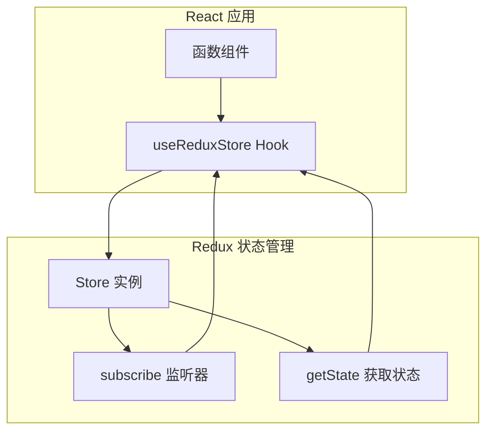
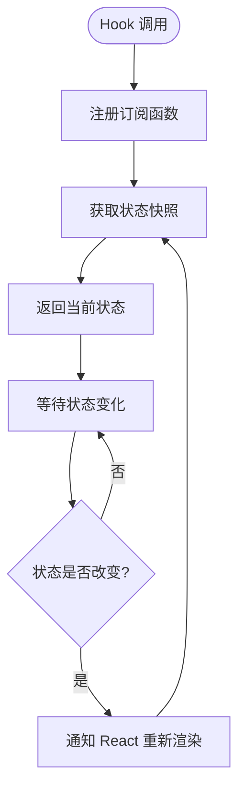
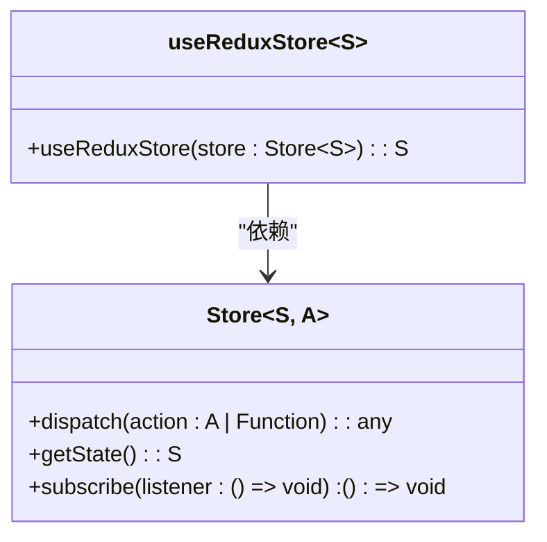
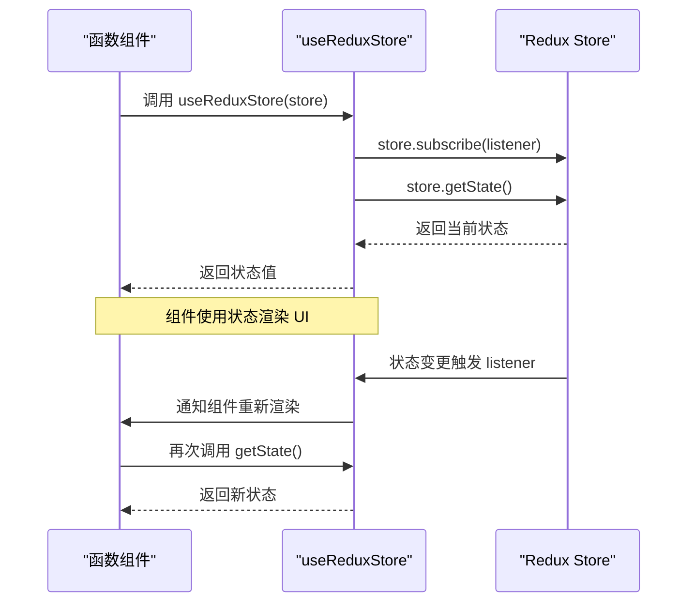
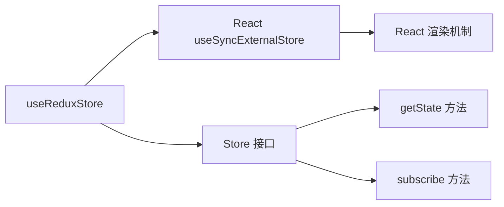

# React 集成

<cite>
**本文档引用的文件**   
- [react-redux.ts](file://src/redux/react-redux.ts)
- [redux.ts](file://src/redux/redux.ts)
- [App.tsx](file://src/App.tsx)
</cite>

## 目录
1. [简介](#简介)
2. [核心组件](#核心组件)
3. [架构概述](#架构概述)
4. [详细组件分析](#详细组件分析)
5. [依赖分析](#依赖分析)
6. [性能考虑](#性能考虑)
7. [故障排除指南](#故障排除指南)
8. [结论](#结论)

## 简介
本文档详细描述了 `react-redux.ts` 文件中 React 与 Redux 的集成机制，重点解析 `useReduxStore` 自定义 Hook 如何基于 `useSyncExternalStore` 实现高效的外部状态订阅。通过分析该 Hook 的实现方式，说明其如何确保组件在 Store 状态变化时及时重新渲染，同时避免不必要的性能开销。文档还展示了在函数组件中使用 `useReduxStore` 获取状态和 dispatch 方法的实际示例，并解释类型定义如何保障 TypeScript 的类型安全。

## 核心组件

`useReduxStore` 是一个自定义 React Hook，用于连接 Redux Store 并订阅其状态变化。它利用 React 18 提供的 `useSyncExternalStore` API 实现高效的状态同步机制。该 Hook 接收一个泛型化的 Store 实例作为参数，并返回当前的 Store 状态。通过此 Hook，函数组件可以安全地读取 Store 状态并在状态更新时自动触发重新渲染。

**组件来源**
- [react-redux.ts](file://src/redux/react-redux.ts#L9-L15)

## 架构概述

该集成方案采用分层架构设计，将 Redux 的状态管理能力与 React 的声明式 UI 更新机制无缝结合。`useSyncExternalStore` 作为桥梁，协调 Store 的状态变更与 React 组件的渲染周期，确保状态更新的即时性和一致性。

**图示来源**
- [react-redux.ts](file://src/redux/react-redux.ts#L9-L15)
- [redux.ts](file://src/redux/redux.ts#L50-L65)

## 详细组件分析

### useReduxStore 分析

`useReduxStore` Hook 的核心在于对 `useSyncExternalStore` 的正确使用。该 API 允许外部状态源（如 Redux Store）与 React 的并发渲染机制协同工作，确保在任何渲染模式下都能正确处理状态更新。

#### Hook 实现机制

**图示来源**
- [react-redux.ts](file://src/redux/react-redux.ts#L9-L15)

#### 类型安全机制

**图示来源**
- [redux.ts](file://src/redux/redux.ts#L10-L25)
- [react-redux.ts](file://src/redux/react-redux.ts#L9-L15)

### 使用示例

在函数组件中使用 `useReduxStore` 的典型模式如下所示。组件通过调用该 Hook 获取 Store 实例的状态，并在状态变化时自动更新 UI。

**图示来源**
- [react-redux.ts](file://src/redux/react-redux.ts#L9-L15)
- [App.tsx](file://src/App.tsx#L10-L20)

**组件来源**
- [react-redux.ts](file://src/redux/react-redux.ts#L9-L15)
- [App.tsx](file://src/App.tsx#L10-L20)

## 依赖分析

该集成方案的主要依赖关系清晰明确，`useReduxStore` 依赖于 React 的 `useSyncExternalStore` API 和 Redux 的 Store 接口定义。这种松耦合的设计使得集成方案具有良好的可维护性和可测试性。

**图示来源**
- [react-redux.ts](file://src/redux/react-redux.ts#L1-L18)
- [redux.ts](file://src/redux/redux.ts#L10-L30)

**组件来源**
- [react-redux.ts](file://src/redux/react-redux.ts#L1-L18)
- [redux.ts](file://src/redux/redux.ts#L10-L30)

## 性能考虑

`useSyncExternalStore` 的使用确保了状态订阅的高效性。该 API 经过优化，能够避免不必要的重新渲染，并与 React 的并发特性兼容。通过直接使用 Store 的 `subscribe` 和 `getState` 方法，`useReduxStore` 实现了最小化的性能开销。

## 故障排除指南

当遇到状态未更新或组件未重新渲染的问题时，应检查以下方面：
- 确保 Store 的 `subscribe` 方法正确触发监听器
- 验证 `getState` 方法返回的是新状态引用
- 检查组件是否正确使用了 `useReduxStore` Hook

**组件来源**
- [react-redux.ts](file://src/redux/react-redux.ts#L9-L15)
- [redux.ts](file://src/redux/redux.ts#L55-L60)

## 结论

`useReduxStore` Hook 提供了一种高效、类型安全的 React 与 Redux 集成方案。通过利用 `useSyncExternalStore`，该实现确保了状态更新的及时性和渲染性能的最优化。泛型类型的使用保障了 TypeScript 的类型安全，使得开发者能够在编译时捕获潜在的类型错误。该方案为在现代 React 应用中集成 Redux 提供了简洁而强大的解决方案。