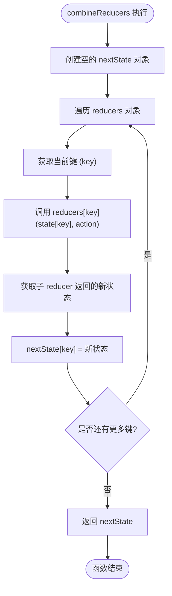

<cite>
**本文档中引用的文件**
- [redux.ts](file://src/redux/redux.ts)
- [App.tsx](file://src/App.tsx)
- [AdvancedFormDemo.tsx](file://src/components/advanced-form/AdvancedFormDemo.tsx)
</cite>

## 目录
1. [简介](#简介)
2. [项目结构](#项目结构)
3. [核心组件](#核心组件)
4. [架构概述](#架构概述)
5. [详细组件分析](#详细组件分析)
6. [依赖分析](#依赖分析)
7. [性能考量](#性能考量)
8. [故障排除指南](#故障排除指南)
9. [结论](#结论)

## 简介
本文档深入解析 `combineReducers` 函数的设计与实现，该函数是 Redux 状态管理库的核心功能之一。文档将详细阐述其如何将多个独立的 reducer 函数合并为一个统一的根 reducer，以支持模块化状态管理。通过分析其 TypeScript 类型定义，解释其如何利用映射类型和泛型约束确保类型安全。同时，文档将探讨合并后的 reducer 在处理 action 时的执行机制，并为不同层次的用户提供从基础理解到高级优化的全面指导。

## 项目结构
该项目是一个基于 React 和 TypeScript 的前端应用，采用 Vite 作为构建工具。代码库的核心状态管理逻辑位于 `src/redux` 目录下，其中 `redux.ts` 文件实现了 Redux 的核心功能，包括 `createStore`、中间件支持以及 `combineReducers` 函数。应用的 UI 组件则分布在 `src/components` 目录中，例如 `AdvancedFormDemo` 组件展示了复杂的表单交互。


**Diagram sources**
- [src/redux/redux.ts](file://src/redux/redux.ts)
- [src/App.tsx](file://src/App.tsx)
- [src/components/advanced-form/AdvancedFormDemo.tsx](file://src/components/advanced-form/AdvancedFormDemo.tsx)

**Section sources**
- [src/redux/redux.ts](file://src/redux/redux.ts)
- [src/App.tsx](file://src/App.tsx)

## 核心组件
`combineReducers` 是本项目状态管理架构中的核心函数。它接收一个由多个子 reducer 组成的对象，并返回一个单一的根 reducer 函数。这个根 reducer 能够根据 action 的类型，精确地调用相应的子 reducer 来更新其负责的那部分状态树，从而实现状态的模块化和隔离。

**Section sources**
- [src/redux/redux.ts](file://src/redux/redux.ts#L106-L116)

## 架构概述
该应用的架构遵循典型的 Redux 模式。UI 组件（如 `AdvancedFormDemo`）通过 `dispatch` 方法发送 action。这些 action 被传递给由 `combineReducers` 创建的根 reducer。根 reducer 遍历其管理的所有子 reducer，将 action 分发给每一个，并收集它们返回的新状态，最终构建出一个全新的、不可变的应用状态树。中间件（如 `loggerMiddleware` 和 `thunkMiddleware`）被插入到 dispatch 流程中，用于处理副作用和异步逻辑。


**Diagram sources**
- [src/redux/redux.ts](file://src/redux/redux.ts#L106-L116)
- [src/components/advanced-form/AdvancedFormDemo.tsx](file://src/components/advanced-form/AdvancedFormDemo.tsx)

## 详细组件分析

### combineReducers 函数分析
`combineReducers` 函数是实现模块化状态管理的关键。它通过一个简单的循环，将一个复杂的根状态更新任务分解为多个独立的、可管理的子任务。

#### 类型定义与类型安全
该函数的类型定义是其强大之处。它使用了 TypeScript 的高级类型特性来确保类型安全。
```mermaid
classDiagram
class combineReducers {
+<T extends Record<string, any>>(reducers : { [K in keyof T] : Reducer<T[K]> }) : Reducer<T>
}
class Reducer {
+(state : S, action : A) : S
}
class Action {
+type : any
+payload? : T
}
combineReducers --> Reducer : "返回"
combineReducers --> Action : "处理"
```

**Diagram sources**
- [src/redux/redux.ts](file://src/redux/redux.ts#L7-L9)
- [src/redux/redux.ts](file://src/redux/redux.ts#L2-L5)

**Section sources**
- [src/redux/redux.ts](file://src/redux/redux.ts#L106-L116)

#### 组合逻辑与执行机制
`combineReducers` 的执行逻辑直观而高效。当一个 action 被 dispatch 时，根 reducer 会创建一个空的 `nextState` 对象。然后，它会遍历传入的 `reducers` 对象的每一个键（key）。对于每个键，它都会调用对应的子 reducer 函数，并传入当前状态树中该键对应的部分（`state?.[key]`）和 action。子 reducer 返回的新状态片段会被直接赋值给 `nextState` 的对应键。这个过程完成后，`nextState` 就包含了所有子 reducer 更新后的状态，它被作为新的根状态返回。



**Diagram sources**
- [src/redux/redux.ts](file://src/redux/redux.ts#L106-L116)

### 概念概述
`combineReducers` 提供了一种优雅的解决方案，用于管理大型应用中日益复杂的状态。它允许开发者将应用状态分割成多个逻辑上独立的域（如用户、订单、UI 状态等），每个域由一个专门的 reducer 管理。这不仅提高了代码的可维护性和可测试性，还通过命名空间隔离避免了状态冲突。


[此图展示的是概念性工作流，不与特定源文件直接关联]

[此部分不分析特定源文件，因此无需列出来源]

## 依赖分析
`combineReducers` 函数的实现依赖于项目中定义的 `Reducer` 和 `Action` 接口。它本身是 `createStore` 函数的输入，而 `createStore` 又被 `applyMiddleware` 等增强函数所使用。最终，`store` 实例被 UI 组件所依赖，形成了一个清晰的依赖链。


**Diagram sources**
- [src/redux/redux.ts](file://src/redux/redux.ts)
- [src/App.tsx](file://src/App.tsx)

**Section sources**
- [src/redux/redux.ts](file://src/redux/redux.ts)
- [src/App.tsx](file://src/App.tsx)

## 性能考量
`combineReducers` 的实现虽然简洁，但在大型应用中仍需注意性能。其主要开销在于每次 action 被 dispatch 时，都会遍历所有子 reducer。即使某个子 reducer 并不处理当前的 action，它也会被调用。为了优化性能，应确保每个子 reducer 都能快速处理无关的 action（通常通过 `default` 分支直接返回原状态）。此外，避免在 reducer 中进行昂贵的计算或深拷贝整个状态树，应仅返回必要的新状态片段。

[此部分提供通用指导，不分析特定源文件]

## 故障排除指南
在使用 `combineReducers` 时，常见的问题包括状态更新不生效或类型错误。状态不更新通常是因为子 reducer 在 `switch` 语句中遗漏了 `default` 分支，导致返回了 `undefined`。类型错误则可能源于 `reducers` 对象的键与期望的根状态结构不匹配。通过检查 `combineReducers` 的调用处和各个子 reducer 的实现，可以有效定位这些问题。

**Section sources**
- [src/redux/redux.ts](file://src/redux/redux.ts#L153-L174)

## 结论
`combineReducers` 函数是 Redux 架构中实现可扩展和可维护状态管理的基石。其设计巧妙地结合了函数式编程思想和 TypeScript 的类型系统，提供了一个既强大又安全的 API。通过将状态管理逻辑分解到独立的模块中，它极大地简化了复杂应用的开发。理解其内部工作原理，对于有效利用 Redux 和构建高性能的前端应用至关重要。