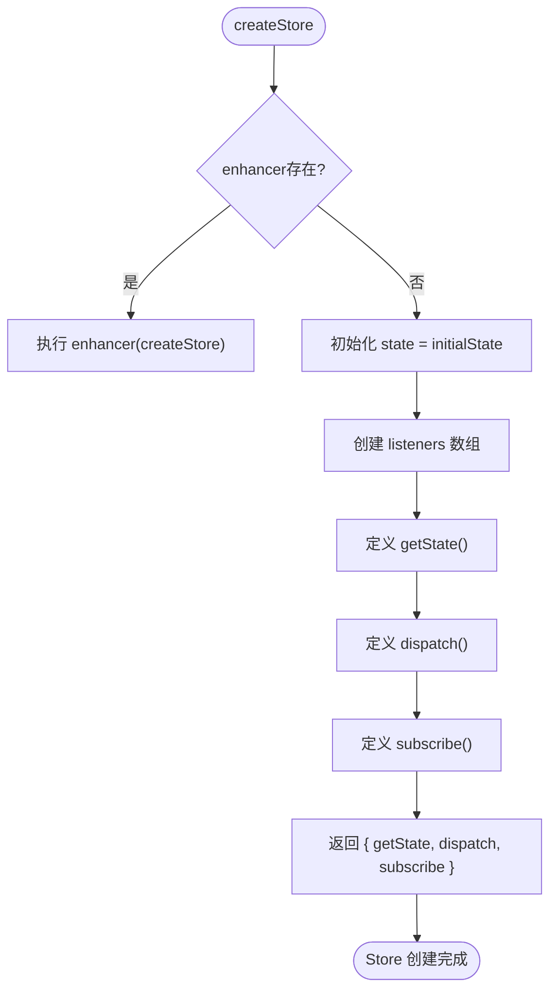
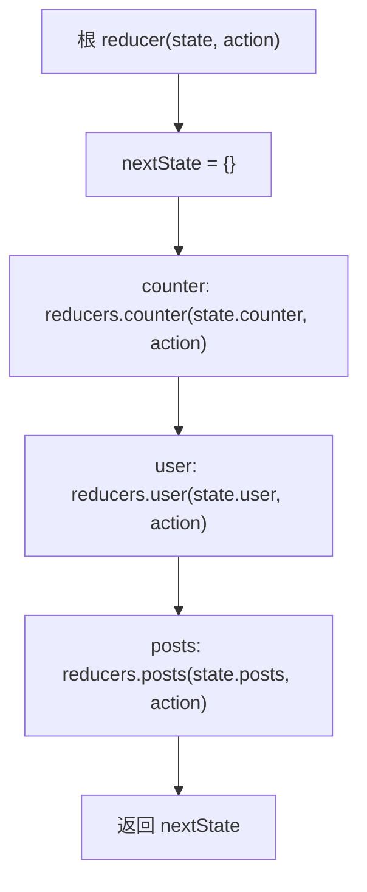
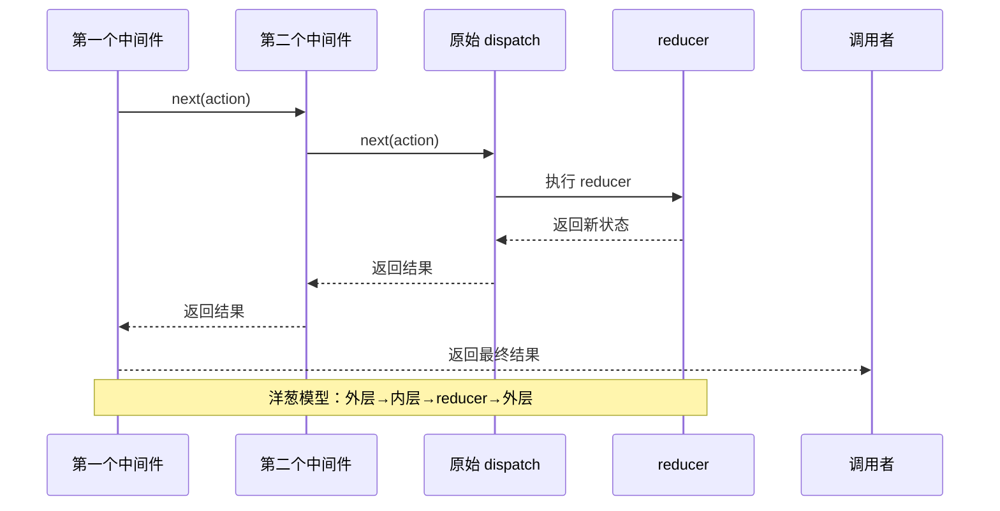
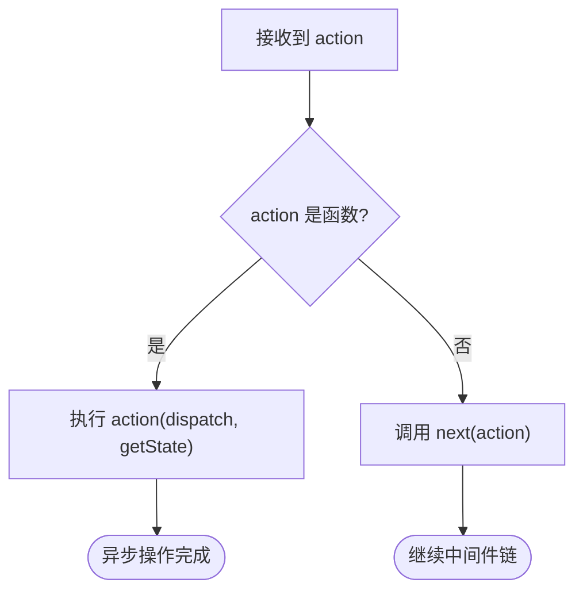
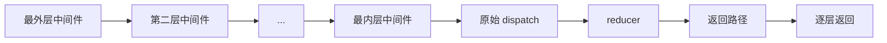

# Redux 核心实现

<cite>
**本文档引用的文件**
- [redux.ts](file://src/redux/redux.ts#L1-L176)
</cite>

## 目录
1. [简介](#简介)
2. [核心类型定义](#核心类型定义)
3. [createStore 函数详解](#createstore-函数详解)
4. [combineReducers 实现机制](#combinereducers-实现机制)
5. [applyMiddleware 与中间件链](#applymiddleware-与中间件链)
6. [中间件实现示例](#中间件实现示例)
7. [不可变状态更新实践](#不可变状态更新实践)
8. [高级函数组合与洋葱模型](#高级函数组合与洋葱模型)
9. [总结](#总结)

## 简介
本文深入解析 `src/redux/redux.ts` 文件中 Redux 核心机制的实现原理。通过分析 `createStore`、`combineReducers` 和 `applyMiddleware` 等关键函数，揭示状态管理库的设计精髓。文档兼顾初学者的概念理解与高级开发者的技术深度，涵盖函数式编程、高阶函数、中间件链式调用等核心思想。

## 核心类型定义

Redux 的类型系统是其可扩展性和类型安全的基础。文件中定义了几个关键接口：

- **Action**: 表示状态变更的最小单位，包含 `type` 字段和可选的 `payload`
- **Reducer**: 纯函数，接收当前状态和动作，返回新状态
- **Store**: 状态容器，提供 `getState`、`dispatch` 和 `subscribe` 三大方法
- **Middleware**: 高阶函数结构，用于扩展 dispatch 行为
- **Enhancer**: 增强器，用于增强 createStore 的功能

这些类型共同构成了 Redux 的类型契约，确保了各组件之间的正确交互。

**Section sources**
- [redux.ts](file://src/redux/redux.ts#L2-L9)

## createStore 函数详解

`createStore` 是 Redux 的核心工厂函数，负责创建一个完整的状态容器。其主要职责包括：

1. 接收 reducer 函数和初始状态
2. 维护私有状态变量 `state`
3. 提供 `getState` 方法读取当前状态
4. 实现 `dispatch` 方法触发状态变更
5. 支持 `subscribe` 机制监听状态变化

当存在 enhancer（增强器）时，会优先执行增强逻辑，这为中间件等扩展功能提供了基础。`dispatch` 方法在接收到 action 后，会调用 reducer 计算新状态，并通知所有订阅者。



**Diagram sources**
- [redux.ts](file://src/redux/redux.ts#L31-L69)

**Section sources**
- [redux.ts](file://src/redux/redux.ts#L31-L69)

## combineReducers 实现机制

`combineReducers` 函数解决了大型应用中状态分割管理的问题。它将多个独立的 reducer 函数合并为一个统一的根 reducer，实现了状态树的模块化。

其实现原理是：
1. 接收一个 reducer 对象映射
2. 返回一个新的 reducer 函数
3. 在每次调用时，遍历所有子 reducer
4. 每个子 reducer 处理自己负责的状态分支
5. 合并所有子 reducer 的结果，生成新的完整状态树

这种设计使得不同功能模块可以独立开发和测试 reducer，同时又能被统一管理。



**Diagram sources**
- [redux.ts](file://src/redux/redux.ts#L106-L116)

**Section sources**
- [redux.ts](file://src/redux/redux.ts#L106-L116)

## applyMiddleware 与中间件链

`applyMiddleware` 是 Redux 扩展机制的核心，它实现了著名的"洋葱模型"中间件架构。其工作流程如下：

1. 创建原始 store
2. 构造 middlewareAPI（包含 getState 和 dispatch）
3. 将每个中间件应用到 middlewareAPI，形成中间件链
4. 使用 compose 函数将中间件链组合成最终的 dispatch 函数
5. 返回增强后的 store

关键在于 `dispatch` 的递归替换：中间件可以调用 `next(action)` 将 action 传递给下一个中间件，形成层层包裹的调用结构。



**Diagram sources**
- [redux.ts](file://src/redux/redux.ts#L85-L104)

**Section sources**
- [redux.ts](file://src/redux/redux.ts#L85-L104)

## 中间件实现示例

文件中提供了两个典型的中间件实现：

### 日志中间件 (loggerMiddleware)
该中间件在 action 分发前后输出日志，便于调试：
- 在调用 `next(action)` 前记录 action 信息
- 在 `next(action)` 返回后记录最新状态
- 完整展示了中间件的"环绕执行"特性

### 异步中间件 (thunkMiddleware)
该中间件支持异步 action：
- 检查 action 是否为函数
- 如果是函数，则执行该函数并传入 dispatch 和 getState
- 实现了异步操作与 Redux 的无缝集成



**Section sources**
- [redux.ts](file://src/redux/redux.ts#L119-L127)

## 不可变状态更新实践

Redux 强调不可变性（Immutability），在 reducer 中必须返回新对象而非修改原状态。文件中的 counterReducer 展示了标准实践：

```typescript
case "INCREMENT":
  return { ...state, count: state.count + 1 };
```

使用对象展开运算符创建新对象，确保：
- 原始状态不被修改
- 状态变更可预测
- 便于实现时间旅行调试
- 优化组件重渲染性能

这种函数式编程范式是 Redux 可靠性的基石。

**Section sources**
- [redux.ts](file://src/redux/redux.ts#L146-L154)

## 高级函数组合与洋葱模型

Redux 的设计充分体现了函数式编程的强大：

### compose 函数
实现了函数的右到左组合，是函数式编程中的经典模式：
```typescript
compose(f, g, h)(x) === f(g(h(x)))
```

### 洋葱模型
中间件的执行呈现出清晰的层次结构：
- 外层中间件先执行前处理逻辑
- 逐层向内传递 action
- 到达 reducer 处理状态变更
- 逐层向外返回结果
- 外层中间件执行后处理逻辑

这种设计既保持了关注点分离，又实现了强大的扩展能力。



**Section sources**
- [redux.ts](file://src/redux/redux.ts#L71-L83)

## 总结
`src/redux/redux.ts` 文件以极简的代码实现了 Redux 的核心功能，展示了函数式编程在状态管理中的强大应用。通过 `createStore` 提供基本状态容器，`combineReducers` 实现模块化管理，`applyMiddleware` 构建扩展体系，三者协同工作，形成了灵活而强大的状态管理解决方案。文档中分析的中间件模式、不可变更新、函数组合等概念，不仅适用于 Redux，也是现代前端架构的重要设计范式。