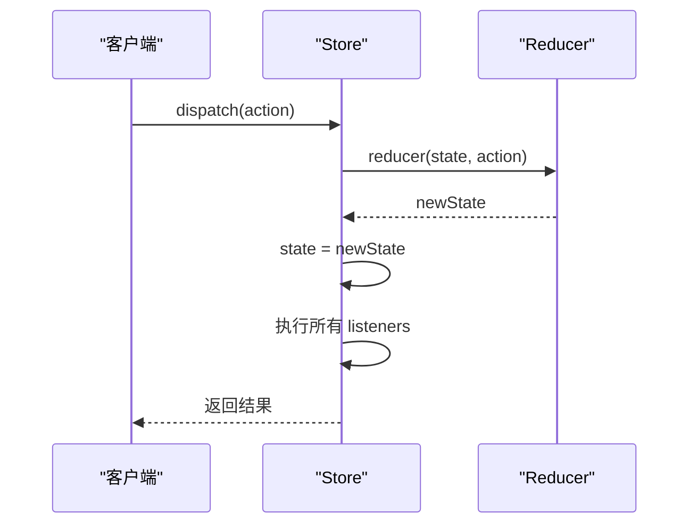

# Store 管理

<cite>
**本文档引用的文件**  
- [redux.ts](file://src/redux/redux.ts#L31-L69)
- [redux.ts](file://src/redux/redux.ts#L1-L176)
- [redux.ts](file://src/redux/redux.ts#L144-L175)
- [react-redux.ts](file://src/redux/react-redux.ts)
</cite>

## 目录
1. [引言](#引言)
2. [createStore 函数实现机制](#createstore-函数实现机制)
3. [Store 的核心方法详解](#store-的核心方法详解)
4. [状态不可变性原则](#状态不可变性原则)
5. [单向数据流模型](#单向数据流模型)
6. [泛型设计与高阶函数封装](#泛型设计与高阶函数封装)
7. [代码示例：初始化与使用 Store](#代码示例：初始化与使用-store)
8. [常见问题排查](#常见问题排查)
9. [结论](#结论)

## 引言
Redux 是一个可预测的状态管理库，其核心是 `Store`。本文深入分析 `src/redux/redux.ts` 中 `createStore` 函数的实现机制，详细解释其如何创建一个包含 `getState`、`dispatch` 和 `subscribe` 方法的状态容器。通过剖析源码，我们将理解 Redux 的核心设计思想，包括状态不可变性、单向数据流以及中间件机制。

**Section sources**
- [redux.ts](file://src/redux/redux.ts#L1-L176)

## createStore 函数实现机制
`createStore` 是 Redux 的核心函数，负责创建一个全局状态容器。该函数接收三个参数：`reducer`、`initialState` 和可选的 `enhancer`。

函数首先判断是否存在 `enhancer`（增强器），如果存在，则将自身作为参数传递给 `enhancer` 并返回其结果，从而实现对 Store 创建过程的扩展能力（如应用中间件）。

若无 `enhancer`，则初始化内部变量：
- `state`：存储当前应用状态，初始值为 `initialState`
- `listeners`：存储状态变更监听函数的数组

随后定义三个核心方法：`getState`、`dispatch` 和 `subscribe`，并返回一个对象暴露这些方法。

```mermaid
flowchart TD
Start([createStore]) --> CheckEnhancer{"enhancer 存在?"}
CheckEnhancer --> |是| ApplyEnhancer[调用 enhancer(createStore)]
CheckEnhancer --> |否| InitState[初始化 state 和 listeners]
InitState --> DefineMethods[定义 getState/dispatch/subscribe]
DefineMethods --> ReturnStore[返回 Store 对象]
ApplyEnhancer --> ReturnStore
ReturnStore --> End([Store 创建完成])
```

**Diagram sources**
- [redux.ts](file://src/redux/redux.ts#L31-L69)

**Section sources**
- [redux.ts](file://src/redux/redux.ts#L31-L69)

## Store 的核心方法详解

### getState 方法
`getState()` 方法用于获取当前状态树的引用。它直接返回内部 `state` 变量，确保状态只能通过 `dispatch` 进行修改，从而维护状态的一致性和可预测性。

### dispatch 方法
`dispatch(action)` 是唯一修改状态的途径。其实现逻辑如下：
1. 若 `action` 为函数（如 Thunk），则直接执行并返回
2. 否则调用 `reducer(state, action)` 计算新状态
3. 更新 `state` 引用
4. 遍历执行所有监听器 `listeners`

此过程体现了 Redux 的同步更新机制。

### subscribe 方法
`subscribe(listener)` 用于注册状态变更监听器。它将监听函数加入 `listeners` 数组，并返回一个取消订阅函数，用于从数组中移除该监听器，防止内存泄漏。



**Diagram sources**
- [redux.ts](file://src/redux/redux.ts#L47-L54)
- [redux.ts](file://src/redux/redux.ts#L56-L69)

**Section sources**
- [redux.ts](file://src/redux/redux.ts#L47-L69)

## 状态不可变性原则
Redux 强调状态的不可变性（Immutability）。在 `counterReducer` 示例中，每次状态更新都通过展开运算符 `{...state}` 创建新对象，而非直接修改原状态：

```ts
case "INCREMENT":
  return { ...state, count: state.count + 1 };
```

这一原则确保了：
- 状态变化可追踪（便于调试和时间旅行）
- 避免意外的副作用
- 提高组件重渲染的性能优化空间（可通过引用比较判断是否变化）

**Section sources**
- [redux.ts](file://src/redux/redux.ts#L144-L175)

## 单向数据流模型
Redux 遵循严格的单向数据流：
1. **View** 触发 `dispatch(action)`
2. **Store** 调用 `reducer` 计算新状态
3. **State** 更新后通知所有订阅者
4. **View** 重新渲染以反映最新状态

这种模式使得数据流动清晰可预测，极大提升了应用的可维护性。

```mermaid
graph LR
A[View] --> |dispatch(action)| B[Store]
B --> |reducer(state, action)| C[State]
C --> |notify| A
C --> |更新| D[UI]
```

**Diagram sources**
- [redux.ts](file://src/redux/redux.ts#L144-L175)

## 泛型设计与高阶函数封装
`createStore` 使用泛型 `<S, A extends Action>` 实现类型安全：
- `S` 表示状态类型
- `A` 表示动作类型，继承自 `Action`

高阶函数设计体现在：
- `enhancer` 接收 `createStore` 并返回新的 `createStore`
- `applyMiddleware` 返回 `enhancer`
- `compose` 实现函数组合，支持中间件链式调用

这些设计使 Redux 具备高度可扩展性和函数式编程特性。

**Section sources**
- [redux.ts](file://src/redux/redux.ts#L0-L54)
- [redux.ts](file://src/redux/redux.ts#L99-L151)

## 代码示例：初始化与使用 Store
以下代码展示了如何创建并使用 Store：

```ts
const store = createStore(counterReducer, { count: 0 }, enhancerMiddleware);
console.log(store.getState()); // { count: 0 }
store.dispatch({ type: "INCREMENT" });
console.log(store.getState()); // { count: 1 }
const unsubscribe = store.subscribe(() => {
  console.log("状态已更新:", store.getState());
});
```

此示例完整演示了 Store 的生命周期管理。

**Section sources**
- [redux.ts](file://src/redux/redux.ts#L144-L175)

## 常见问题排查

### 状态未更新
可能原因：
- `reducer` 未正确返回新状态
- `action.type` 匹配失败
- 初始状态未正确传入

### 监听器泄漏
未调用 `subscribe` 返回的函数会导致监听器无法释放。应确保在适当时机取消订阅：

```ts
const unsubscribe = store.subscribe(listener);
// 在组件卸载或不再需要时
unsubscribe();
```

**Section sources**
- [redux.ts](file://src/redux/redux.ts#L56-L69)

## 结论
`createStore` 函数通过闭包封装状态与逻辑，实现了 Redux 的核心功能。其简洁而强大的设计体现了函数式编程的精髓。理解其内部机制有助于更好地使用 Redux，并为学习更复杂的状态管理方案打下坚实基础。