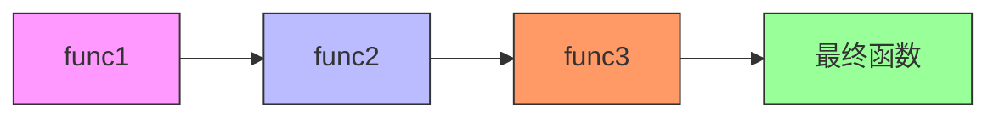
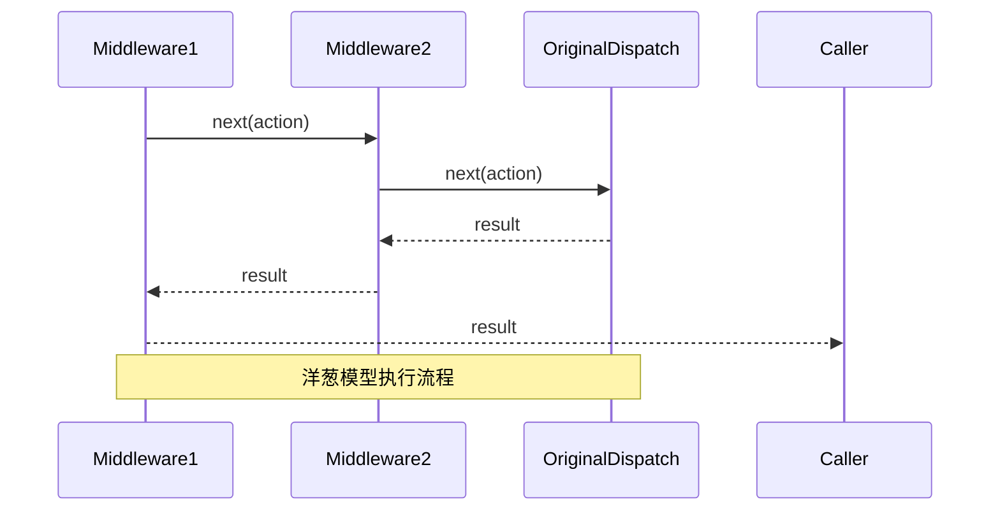

# applyMiddleware 架构解析

<cite>
**本文档引用的文件**  
- [redux.ts](file://src/redux/redux.ts#L85-L104)
- [redux.ts](file://src/redux/redux.ts#L31-L69)
- [redux.ts](file://src/redux/redux.ts#L71-L83)
- [redux.ts](file://src/redux/redux.ts#L97)
- [redux.ts](file://src/redux/redux.ts#L140)
- [redux.ts](file://src/redux/redux.ts#L166)
</cite>

## 目录
1. [引言](#引言)
2. [applyMiddleware 函数结构解析](#applymiddleware-函数结构解析)
3. [中间件链的构建流程](#中间件链的构建流程)
4. [compose 函数执行机制分析](#compose-函数执行机制分析)
5. [洋葱模型调用堆栈原理](#洋葱模型调用堆栈原理)
6. [中间件执行顺序可视化示例](#中间件执行顺序可视化示例)
7. [函数式编程思想的应用](#函数式编程思想的应用)
8. [常见问题与调试方法](#常见问题与调试方法)
9. [总结](#总结)

## 引言
`applyMiddleware` 是 Redux 中核心的 Store Enhancer 机制，它通过高阶函数的方式在 `createStore` 过程中增强 `dispatch` 功能。本文将深入解析其内部实现机制，重点阐述中间件链的构建、函数组合的执行逻辑以及“洋葱模型”的形成原理，为开发者提供从初学者到高级应用的全面理解。

## applyMiddleware 函数结构解析
`applyMiddleware` 接收多个中间件函数作为参数，返回一个 Store Enhancer 函数。该 Enhancer 在 `createStore` 被调用时介入，创建原始 store 后，通过注入 `middlewareAPI`（包含 `getState` 和封装后的 `dispatch`），预执行中间件以生成接收 `next` 的函数链。

**Section sources**  
- [redux.ts](file://src/redux/redux.ts#L85-L104)

## 中间件链的构建流程
中间件链的构建分为三个关键阶段：
1. **middlewareAPI 注入**：将 `store.getState` 和封装的 `dispatch` 传递给每个中间件。
2. **中间件预执行（map 阶段）**：通过 `middlewares.map(middleware => middleware(middlewareAPI))` 生成一个函数数组，每个函数都接收 `next` 参数。
3. **dispatch 替换**：使用 `compose(...chain)(store.dispatch)` 将函数链组合并应用到原始 `dispatch` 上，生成新的 `dispatch` 函数。

```mermaid
flowchart TD
A[applyMiddleware(...middlewares)] --> B[createStore(reducer, initialState)]
B --> C[构建 middlewareAPI]
C --> D[getState: store.getState]
C --> E[dispatch: (action) => dispatch(action)]
D --> F[中间件预执行]
E --> F
F --> G[chain = middlewares.map(middleware(middlewareAPI))]
G --> H[dispatch = compose(...chain)(store.dispatch)]
H --> I[返回增强的 store]
```

**Diagram sources**  
- [redux.ts](file://src/redux/redux.ts#L85-L104)

**Section sources**  
- [redux.ts](file://src/redux/redux.ts#L85-L104)

## compose 函数执行机制分析
`compose` 函数是函数式编程中函数组合的核心实现。它将多个函数从右到左依次组合，形成一个新的高阶函数。其执行逻辑如下：
- 当函数数组为空时，返回恒等函数 `(arg) => arg`。
- 当只有一个函数时，直接返回该函数。
- 对于多个函数，使用 `reduce` 将函数组合为 `a(b(...args))` 的形式，确保右侧函数先执行。



**Diagram sources**  
- [redux.ts](file://src/redux/redux.ts#L71-L83)

**Section sources**  
- [redux.ts](file://src/redux/redux.ts#L71-L83)

## 洋葱模型调用堆栈原理
“洋葱模型”描述了中间件的执行顺序：外层中间件先执行前半部分，然后逐层向内，到达原始 `dispatch` 后，再从内向外逐层执行后半部分。这种结构使得每个中间件都能在 action 被处理前后执行逻辑，如日志记录、异步处理等。



**Diagram sources**  
- [redux.ts](file://src/redux/redux.ts#L85-L104)

**Section sources**  
- [redux.ts](file://src/redux/redux.ts#L85-L104)

## 中间件执行顺序可视化示例
假设配置了 `loggerMiddleware` 和 `thunkMiddleware`，执行顺序如下：
1. `loggerMiddleware` 打印 action。
2. 调用 `next`，进入 `thunkMiddleware`。
3. `thunkMiddleware` 判断 action 是否为函数，若是则执行并返回。
4. 返回至 `loggerMiddleware`，打印新状态。
5. 完成整个流程。

```mermaid
flowchart TB
A[dispatch(action)] --> B[loggerMiddleware]
B --> C[thunkMiddleware]
C --> D{action 是函数?}
D --> |是| E[执行 action(dispatch, getState)]
D --> |否| F[调用 next(action)]
F --> G[reducer 处理]
G --> H[更新 state]
H --> I[触发 listeners]
I --> J[返回结果]
E --> J
J --> K[loggerMiddleware 打印新状态]
K --> L[返回结果]
```

**Diagram sources**  
- [redux.ts](file://src/redux/redux.ts#L120-L130)

**Section sources**  
- [redux.ts](file://src/redux/redux.ts#L120-L130)

## 函数式编程思想的应用
`applyMiddleware` 充分体现了函数式编程中的柯里化和函数组合：
- **柯里化**：中间件函数 `(store) => (next) => (action) => {}` 将多参数函数分解为一系列单参数函数。
- **函数组合**：`compose` 函数将多个中间件函数组合成一个单一的转换函数，实现了逻辑的模块化和可复用性。

**Section sources**  
- [redux.ts](file://src/redux/redux.ts#L85-L104)

## 常见问题与调试方法
### 中间件顺序配置错误
若将 `thunkMiddleware` 置于 `loggerMiddleware` 之后，异步 action 可能被阻断，因为 `loggerMiddleware` 无法处理函数类型的 action。

### 调试方法
1. 检查中间件注册顺序，确保异步中间件（如 thunk）在日志等中间件之前。
2. 使用 `console.log` 输出中间件的执行流程，验证“洋葱模型”是否正确形成。

**Section sources**  
- [redux.ts](file://src/redux/redux.ts#L166)

## 总结
`applyMiddleware` 通过巧妙的函数组合和柯里化，实现了对 `dispatch` 功能的灵活增强。理解其内部机制不仅有助于正确使用 Redux 中间件，还能深入掌握函数式编程的核心思想。合理配置中间件顺序是避免常见问题的关键。