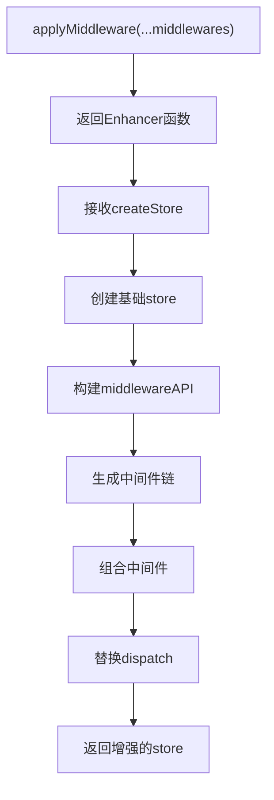
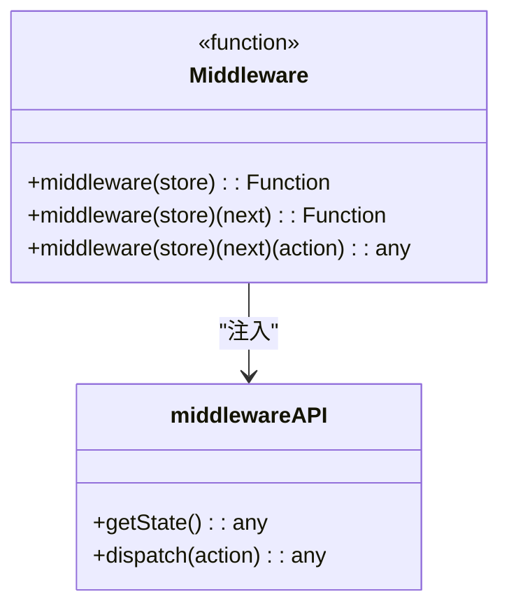
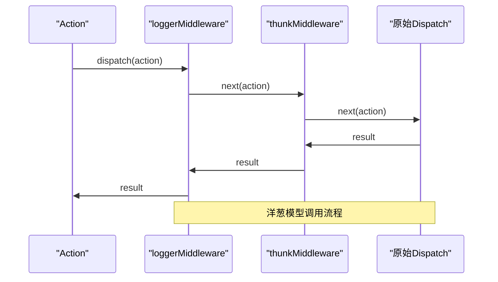
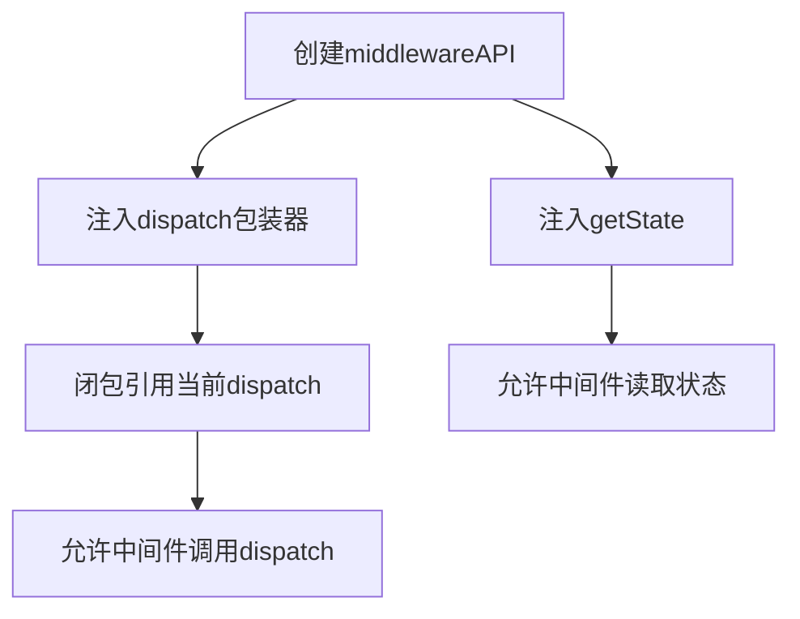
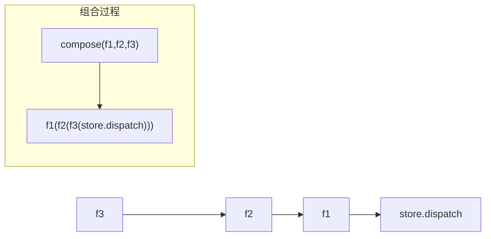
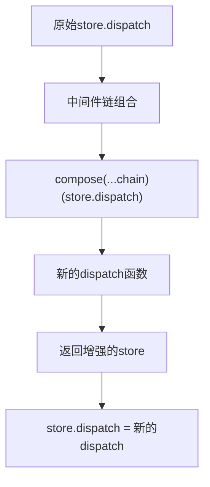
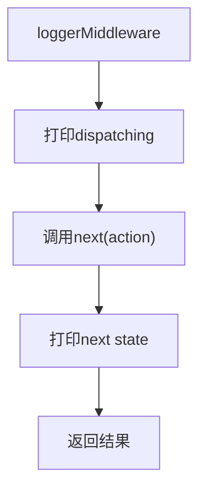
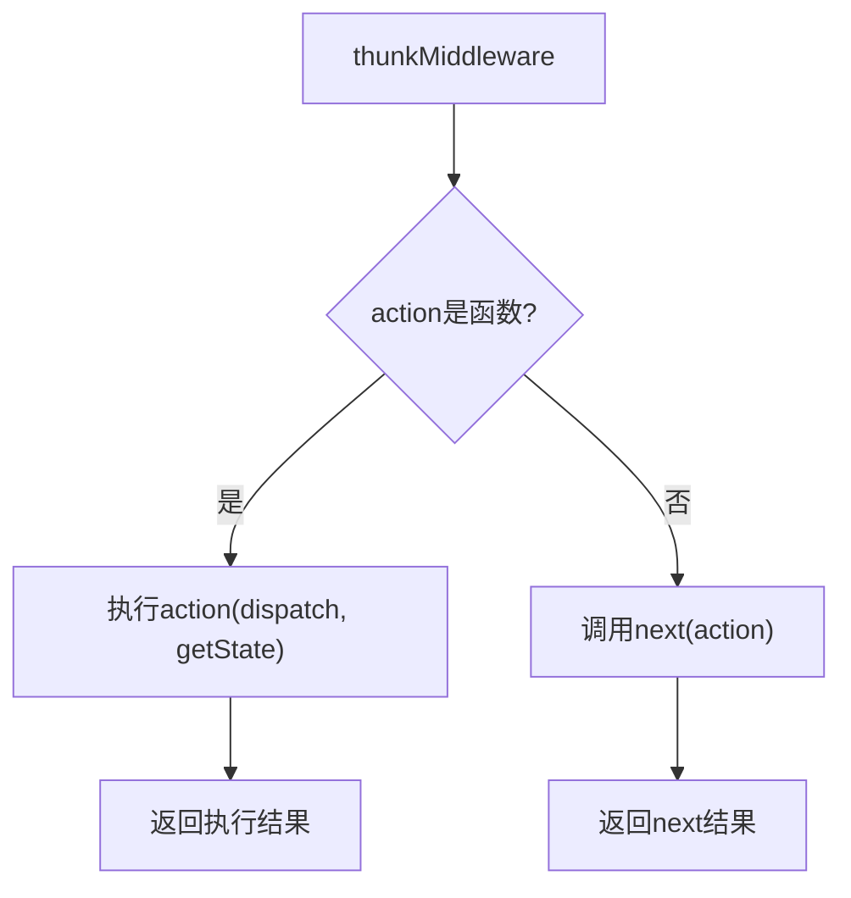
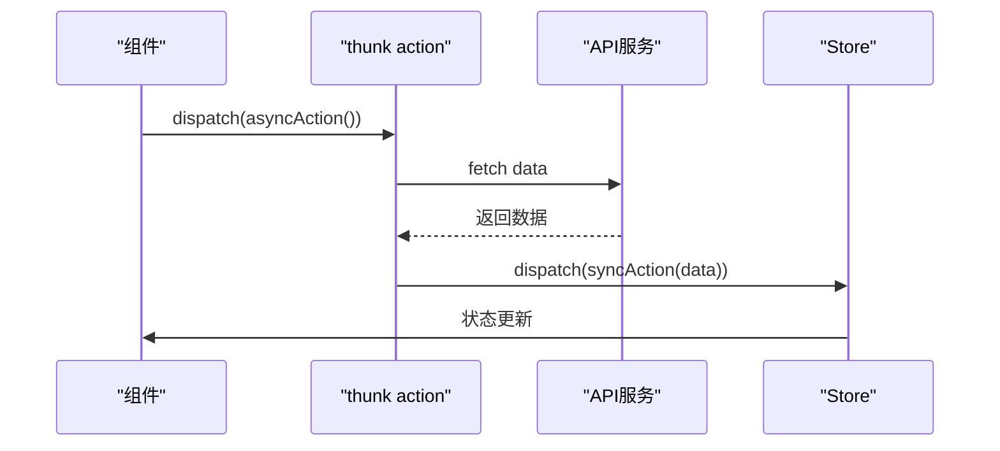

<cite>
**本文档中引用的文件**   
- [redux.ts](file://src/redux/redux.ts)
- [react-redux.ts](file://src/redux/react-redux.ts)
- [README.md](file://README.md)
</cite>

## 目录
1. [中间件系统](#中间件系统)
2. [applyMiddleware函数工作原理](#applymiddleware函数工作原理)
3. [中间件链构建过程](#中间件链构建过程)
4. [洋葱模型调用结构](#洋葱模型调用结构)
5. [middlewareAPI注入机制](#middlewareapi注入机制)
6. [函数组合实现](#函数组合实现)
7. [dispatch替换过程](#dispatch替换过程)
8. [loggerMiddleware实现](#loggermiddleware实现)
9. [thunkMiddleware实现](#thunkmiddleware实现)
10. [thunk action示例](#thunk-action示例)
11. [中间件顺序配置](#中间件顺序配置)
12. [常见问题调试指南](#常见问题调试指南)

## 中间件系统

Redux中间件系统是连接action与reducer之间的关键桥梁，它允许开发者在action被分发后、到达reducer之前拦截并处理这些action。该系统通过高阶函数和函数式编程思想构建，实现了灵活的扩展性和强大的功能定制能力。

**Section sources**
- [redux.ts](file://src/redux/redux.ts#L0-L176)

## applyMiddleware函数工作原理

`applyMiddleware`函数是Redux中间件系统的入口点，其核心作用是创建一个store enhancer，用于增强原始的store功能。该函数接收一系列中间件作为参数，并返回一个高阶函数，该函数接受`createStore`函数作为参数，最终返回一个被增强的store实例。

**Diagram sources**
- [redux.ts](file://src/redux/redux.ts#L85-L104)

**Section sources**
- [redux.ts](file://src/redux/redux.ts#L85-L104)

## 中间件链构建过程

中间件链的构建始于`applyMiddleware`函数内部对传入中间件数组的遍历。每个中间件函数首先接收`middlewareAPI`对象（包含`getState`和`dispatch`方法），然后返回一个接收`next`函数的函数，最后返回一个处理`action`的函数。这个过程形成了一个三层函数嵌套结构。

**Diagram sources**
- [redux.ts](file://src/redux/redux.ts#L85-L104)

**Section sources**
- [redux.ts](file://src/redux/redux.ts#L85-L104)

## 洋葱模型调用结构

中间件的调用遵循"洋葱模型"，即当一个action被分发时，它会依次穿过每一层中间件，先从外层进入内层，到达最内层的原始`dispatch`后，再逐层返回。这种结构使得每个中间件既能处理进入的action，也能处理离开的响应结果。

**Diagram sources**
- [redux.ts](file://src/redux/redux.ts#L144-L151)

**Section sources**
- [redux.ts](file://src/redux/redux.ts#L144-L151)

## middlewareAPI注入机制

`middlewareAPI`是一个关键对象，它为每个中间件提供了访问store状态和分发action的能力。该对象在`applyMiddleware`函数内部创建，包含`getState`和`dispatch`两个方法。其中`dispatch`方法被包装在一个闭包中，确保中间件可以调用到最终被替换后的`dispatch`函数。

**Diagram sources**
- [redux.ts](file://src/redux/redux.ts#L90-L94)

**Section sources**
- [redux.ts](file://src/redux/redux.ts#L90-L94)

## 函数组合实现

`compose`函数是实现中间件链式调用的核心工具，它采用函数式编程中的组合模式，将多个函数从右到左依次组合成一个新的函数。这种组合方式确保了中间件的执行顺序符合预期，即最右边的中间件最先执行。

**Diagram sources**
- [redux.ts](file://src/redux/redux.ts#L71-L83)

**Section sources**
- [redux.ts](file://src/redux/redux.ts#L71-L83)

## dispatch替换过程

在中间件链构建完成后，`applyMiddleware`会使用`compose`函数将所有中间件组合成一个新的`dispatch`函数，并将其赋值给局部变量`dispatch`。这个新的`dispatch`函数包含了所有中间件的逻辑，从而替换了原始store的`dispatch`方法，实现了功能增强。

**Diagram sources**
- [redux.ts](file://src/redux/redux.ts#L96-L102)

**Section sources**
- [redux.ts](file://src/redux/redux.ts#L96-L102)

## loggerMiddleware实现

`loggerMiddleware`是一个典型的同步中间件，用于在开发环境中记录action的分发和状态变化。它通过拦截action，在调用`next`前后分别打印日志信息，从而实现了对应用状态流的可视化监控。

**Diagram sources**
- [redux.ts](file://src/redux/redux.ts#L144-L151)

**Section sources**
- [redux.ts](file://src/redux/redux.ts#L144-L151)

## thunkMiddleware实现

`thunkMiddleware`是处理异步操作的关键中间件，它通过检查action的类型，允许函数形式的action creator存在。当遇到函数类型的action时，它会执行该函数并传入`dispatch`和`getState`作为参数，从而实现异步逻辑的编写。

**Diagram sources**
- [redux.ts](file://src/redux/redux.ts#L152-L157)

**Section sources**
- [redux.ts](file://src/redux/redux.ts#L152-L157)

## thunk action示例

thunk action允许开发者编写返回函数的action creator，这些函数可以在内部执行异步操作（如API调用），并在操作完成后分发同步action来更新状态。这种方式解决了Redux原生只支持同步action的问题。

**Diagram sources**
- [redux.ts](file://src/redux/redux.ts#L152-L157)

**Section sources**
- [redux.ts](file://src/redux/redux.ts#L152-L157)

## 中间件顺序配置

中间件的执行顺序至关重要，它们按照在`applyMiddleware`中声明的顺序从左到右排列。例如，`applyMiddleware(loggerMiddleware, thunkMiddleware)`意味着logger中间件会先于thunk中间件执行。错误的顺序可能导致功能异常，如logger无法记录异步action。

**Section sources**
- [redux.ts](file://src/redux/redux.ts#L173-L175)

## 常见问题调试指南

1. **中间件不生效**：检查是否正确应用了`applyMiddleware` enhancer，并确认store创建时传入了正确的中间件数组。
2. **异步action未执行**：确保`thunkMiddleware`已包含在中间件列表中，并且action creator返回的是函数而非普通对象。
3. **dispatch循环调用**：避免在中间件中直接调用原始`store.dispatch`，应使用注入的`dispatch`方法。
4. **状态更新延迟**：理解中间件的异步处理机制，确保在适当的位置调用`next(action)`。

**Section sources**
- [redux.ts](file://src/redux/redux.ts#L85-L104)
- [redux.ts](file://src/redux/redux.ts#L152-L157)