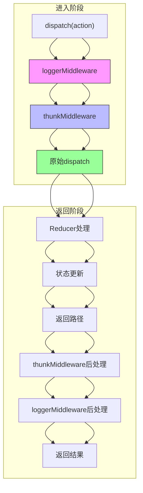

# 中间件组合与顺序

<cite>
**Referenced Files in This Document**   
- [redux.ts](file://src/redux/redux.ts)
- [react-redux.ts](file://src/redux/react-redux.ts)
</cite>

## 目录
1. [中间件执行顺序原理](#中间件执行顺序原理)
2. [logger与thunk中间件组合分析](#logger与thunk中间件组合分析)
3. [洋葱模型图解](#洋葱模型图解)
4. [createStoreWithMiddleware工具函数](#createstorewithmiddleware工具函数)
5. [中间件顺序配置最佳实践](#中间件顺序配置最佳实践)

## 中间件执行顺序原理

Redux中间件的执行遵循"洋葱模型"，中间件的执行顺序由其在`applyMiddleware`函数中的注册顺序决定。当多个中间件被应用时，它们会形成一个嵌套的函数调用链，每个中间件都有机会在action被传递到下一个中间件之前和之后执行代码。

中间件的执行过程分为两个阶段：进入阶段和返回阶段。在进入阶段，action从最外层的中间件开始，逐层向内传递，直到到达原始的`dispatch`函数。在返回阶段，处理结果从内向外逐层返回，经过每个中间件的后处理逻辑。

这种执行机制确保了中间件能够拦截和处理所有经过`dispatch`的action，无论是同步还是异步action。

**Section sources**
- [redux.ts](file://src/redux/redux.ts#L56-L104)

## logger与thunk中间件组合分析

### 正确顺序：logger在thunk之后

当`loggerMiddleware`位于`thunkMiddleware`之后时，系统能够正确记录异步action触发的后续action。这是因为`thunkMiddleware`首先拦截了函数类型的action，执行异步逻辑并触发新的action，然后这些新的action会继续通过中间件链，被`loggerMiddleware`记录。

```typescript
const enhancerMiddleware = applyMiddleware(loggerMiddleware, thunkMiddleware);
```

在这种配置下，日志中间件能够捕获到所有action，包括由thunk中间件生成的后续action，从而提供完整的状态变化追踪。

### 错误顺序：thunk在logger之前

如果`thunkMiddleware`位于`loggerMiddleware`之前，会导致异步action被忽略。这是因为`thunkMiddleware`会拦截函数类型的action并执行，但不会将这些函数action传递给后续的中间件。结果是`loggerMiddleware`无法记录这些异步action的触发，导致日志信息不完整。

这种错误配置会破坏调试能力，开发者无法通过日志追踪异步操作的执行流程。

**Section sources**
- [redux.ts](file://src/redux/redux.ts#L144-L175)

## 洋葱模型图解



**Diagram sources**
- [redux.ts](file://src/redux/redux.ts#L99-L151)

## createStoreWithMiddleware工具函数

`createStoreWithMiddleware`是一个便捷的工具函数，用于简化多中间件的集成流程。该函数封装了`applyMiddleware`和`createStore`的调用，提供了一个更简洁的API来创建配置了中间件的store。

```typescript
export const createStoreWithMiddleware = <S, A extends Action = Action>(
  reducer: Reducer<S, A>,
  initialState: S,
  ...middlewares: Middleware[]
) => {
  const enhancer = applyMiddleware(...middlewares);
  return createStore(reducer, initialState, enhancer);
};
```

使用此函数可以避免重复编写中间件应用的样板代码，提高代码的可读性和可维护性。开发者只需传入reducer、初始状态和中间件列表，即可创建配置好的store实例。

**Section sources**
- [redux.ts](file://src/redux/redux.ts#L144-L151)

## 中间件顺序配置最佳实践

### 日志中间件置于最外层

日志中间件通常应该放置在中间件链的最外层（即`applyMiddleware`调用中的最后一个参数），这样它可以捕获所有经过`dispatch`的action，包括由其他中间件生成的action。这种配置确保了日志的完整性和准确性，为调试和监控提供可靠的数据。

### 错误处理中间件置于最内层

错误处理中间件通常需要放置在中间件链的最内层（即`applyMiddleware`调用中的第一个参数），这样它可以捕获所有中间件和reducer执行过程中抛出的异常。这种配置确保了错误处理的全面性，防止异常中断中间件链的执行。

### 异步处理中间件位置

异步处理中间件（如thunk）应该放置在日志中间件之后，但在其他业务中间件之前。这种位置确保了异步action能够被正确处理，同时其生成的后续action也能被日志中间件记录。

遵循这些最佳实践可以确保中间件系统的稳定性和可维护性，避免常见的配置错误。

**Section sources**
- [redux.ts](file://src/redux/redux.ts#L99-L151)