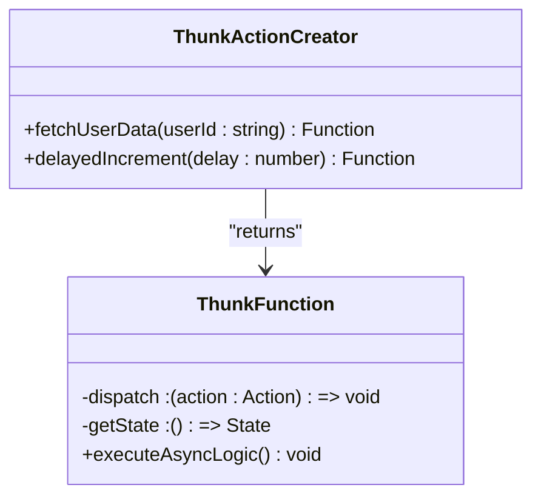
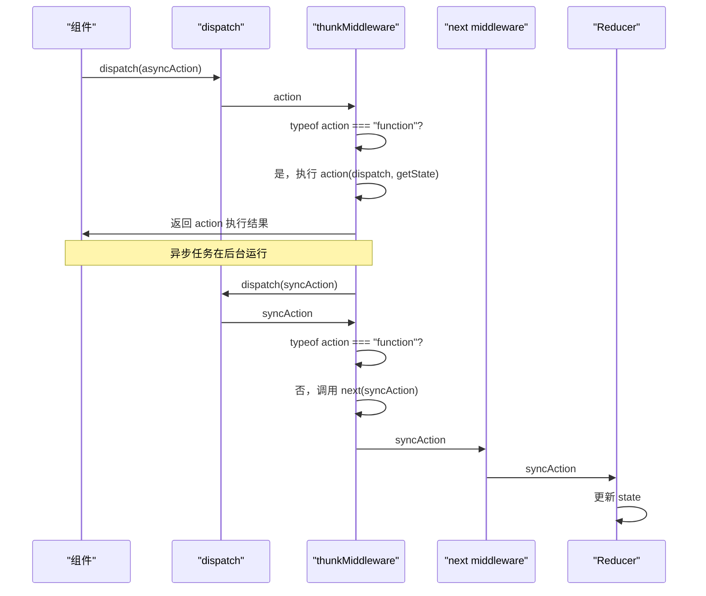

# 异步中间件

<cite>
**本文档引用的文件**  
- [redux.ts](file://src/redux/redux.ts)
- [react-redux.ts](file://src/redux/react-redux.ts)
</cite>

## 目录
1. [简介](#简介)
2. [thunkMiddleware 核心机制](#thunkmiddleware-核心机制)
3. [thunk action creator 编写模式](#thunk-action-creator-编写模式)
4. [内部执行流程分析](#内部执行流程分析)
5. [典型用例与代码示例](#典型用例与代码示例)
6. [最佳实践与注意事项](#最佳实践与注意事项)
7. [总结](#总结)

## 简介
Redux 是一个可预测的状态管理库，其核心设计原则是同步更新。然而，在现代前端应用中，异步操作（如 API 调用、定时任务）无处不在。`thunkMiddleware` 作为 Redux 生态中最流行的中间件之一，通过扩展 `dispatch` 函数的能力，巧妙地解决了这一限制。本文档将深入解析 `thunkMiddleware` 的工作原理，阐明其如何通过判断 action 类型来拦截并执行异步逻辑，为开发者提供清晰的使用指导。

## thunkMiddleware 核心机制

`thunkMiddleware` 的核心在于其对 action 类型的判断。在 Redux 的中间件链中，每个中间件都会接收一个 `next` 函数和当前的 `store` 实例。`thunkMiddleware` 会检查传入的 action 是否为函数类型。

```mermaid
flowchart TD
A[dispatch(action)] --> B{action 是函数吗?}
B --> |是| C[执行 action(dispatch, getState)]
B --> |否| D[调用 next(action)]
C --> E[在函数内部进行异步操作]
E --> F[异步完成后手动 dispatch 普通 action]
D --> G[继续中间件链或更新 state]
```

**Diagram sources**  
- [redux.ts](file://src/redux/redux.ts#L127-L130)

当 `thunkMiddleware` 检测到 action 是一个函数时，它不会将其传递给 `next`（即下一个中间件或最终的 reducer），而是立即调用这个函数，并将 `store.dispatch` 和 `store.getState` 作为参数传入。这使得该函数可以在其内部执行任意的异步逻辑，并在适当时机通过 `dispatch` 触发状态更新。

**Section sources**  
- [redux.ts](file://src/redux/redux.ts#L127-L130)

## thunk action creator 编写模式

编写一个 thunk action creator 的标准模式是返回一个函数，该函数接受 `(dispatch, getState)` 作为参数。这种模式赋予了开发者在异步回调中完全控制 `dispatch` 的能力。



**Diagram sources**  
- [redux.ts](file://src/redux/redux.ts#L127-L130)

这种模式的关键优势在于：
- **延迟 dispatch**：可以在 `setTimeout`、`Promise.then` 或 `async/await` 中延迟 dispatch 普通 action。
- **条件 dispatch**：可以根据当前的 `getState()` 结果来决定是否以及如何 dispatch action。
- **组合操作**：可以 dispatch 多个 action，例如先 dispatch 一个 `LOADING_START`，再在 API 调用成功后 dispatch `LOADING_SUCCESS`。

**Section sources**  
- [redux.ts](file://src/redux/redux.ts#L127-L130)

## 内部执行流程分析

`thunkMiddleware` 的执行流程是 Redux 中间件洋葱模型的典型应用。其定义为 `(store) => (next) => (action)` 的三层函数结构。

1.  **第一层**：接收 `store` 对象，从中提取 `dispatch` 和 `getState` 方法。
2.  **第二层**：接收 `next` 函数，这是中间件链中的下一个处理函数。
3.  **第三层**：接收实际的 `action`。

当一个 action 被 `dispatch` 时，它首先经过 `thunkMiddleware` 的最内层函数。如果 action 是函数，则直接执行 `action(dispatch, getState)`，并返回其执行结果。如果 action 不是函数，则通过 `next(action)` 将其传递给后续的中间件或 reducer。



**Diagram sources**  
- [redux.ts](file://src/redux/redux.ts#L127-L130)

**Section sources**  
- [redux.ts](file://src/redux/redux.ts#L127-L130)

## 典型用例与代码示例

### 异步请求（API 调用）
这是最常见也是最核心的用例。thunk action creator 可以发起一个网络请求，并在请求成功或失败后 dispatch 相应的 action。

```typescript
// 示例：获取用户数据
const fetchUserData = (userId: string) => {
  return async (dispatch: Function, getState: () => any) => {
    dispatch({ type: 'FETCH_USER_REQUEST' });
    try {
      const response = await fetch(`/api/users/${userId}`);
      const userData = await response.json();
      dispatch({ type: 'FETCH_USER_SUCCESS', payload: userData });
    } catch (error) {
      dispatch({ type: 'FETCH_USER_FAILURE', payload: error.message });
    }
  };
};
```

### 延迟 dispatch
利用 `setTimeout` 或 `setInterval` 来实现延迟或周期性的状态更新。

```typescript
// 示例：延迟增加计数器
const delayedIncrement = (delay: number) => {
  return (dispatch: Function) => {
    setTimeout(() => {
      dispatch({ type: 'INCREMENT' });
    }, delay);
  };
};
```

**Section sources**  
- [redux.ts](file://src/redux/redux.ts#L144-L175)

## 最佳实践与注意事项

### 避免直接修改 state
在 thunk 函数内部，应始终通过 `dispatch` 来更新状态，而不是直接修改 `getState()` 返回的对象。直接修改 state 会破坏 Redux 的不可变性原则，导致状态更新不可预测，且无法被开发者工具正确追踪。

### 使用 try-catch 处理异步错误
所有异步操作都应被 `try-catch` 块包裹，以确保任何错误都能被捕获并以一种可预测的方式处理（通常是 dispatch 一个错误 action），防止未捕获的异常导致应用崩溃。

### 合理组织 action 类型
为异步操作定义清晰的 action 类型，如 `REQUEST`、`SUCCESS`、`FAILURE`，这有助于在 reducer 中清晰地管理加载状态和错误状态。

### 利用 getState 进行优化
在发起请求前，可以使用 `getState()` 检查数据是否已经存在或是否正在加载，从而避免不必要的重复请求，提升应用性能。

**Section sources**  
- [redux.ts](file://src/redux/redux.ts#L127-L130)

## 总结

`thunkMiddleware` 通过一个简单而强大的机制——检查 action 是否为函数——成功地将 Redux 从纯同步的限制中解放出来。它允许开发者编写返回函数的 action creator，这些函数在执行时可以访问 `dispatch` 和 `getState`，从而在异步逻辑完成后手动触发状态更新。这种模式不仅解决了异步操作的核心需求，还保持了 Redux 核心概念的简洁性。通过遵循避免直接修改 state 和使用 `try-catch` 处理错误等最佳实践，开发者可以构建出健壮、可维护且可预测的异步应用。