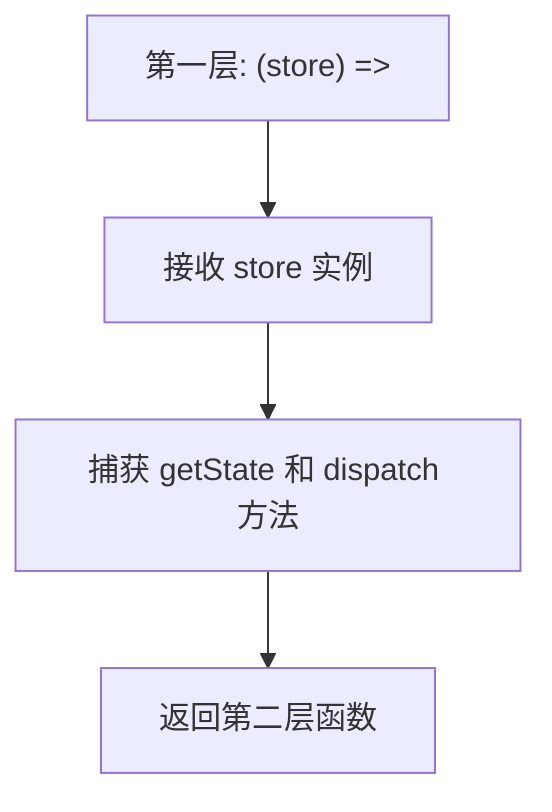
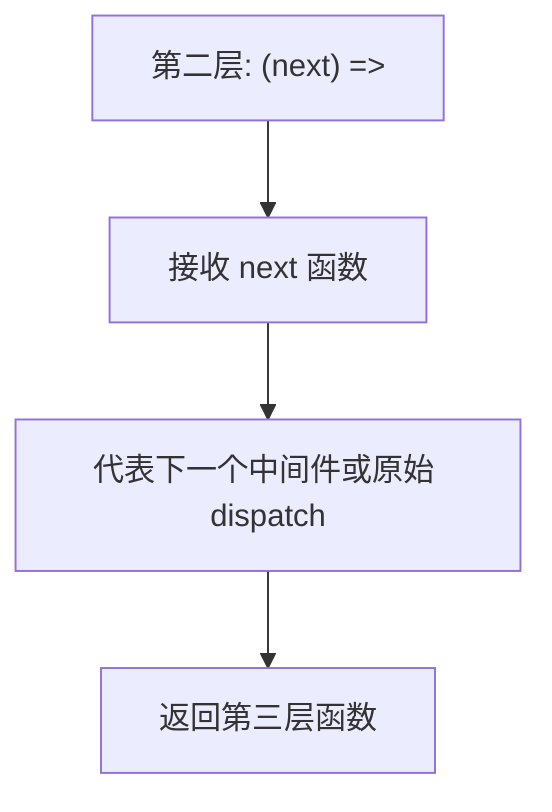
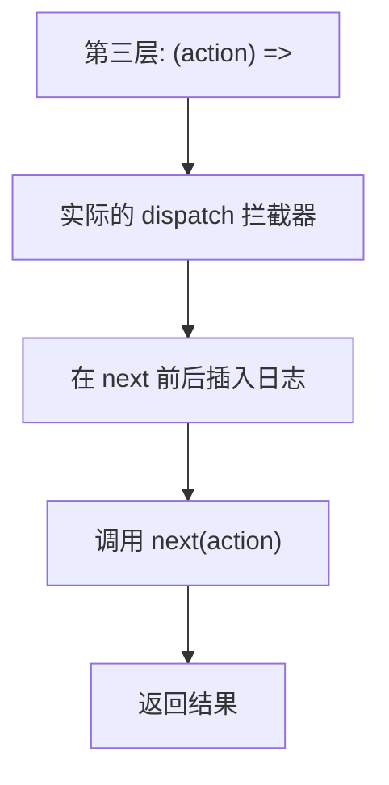

# 日志中间件

<cite>
**Referenced Files in This Document**   
- [redux.ts](file://src/redux/redux.ts)
</cite>

## 目录
1. [引言](#引言)
2. [核心实现逻辑](#核心实现逻辑)
3. [三层函数结构解析](#三层函数结构解析)
4. [控制台输出示例](#控制台输出示例)
5. [生产环境性能考量](#生产环境性能考量)
6. [扩展实现方案](#扩展实现方案)
7. [结论](#结论)

## 引言
本文档详细解析 `loggerMiddleware` 的实现机制，阐述其作为最基础的 Redux 中间件如何非侵入式地监控应用状态变更。通过分析其代码结构与执行流程，指导开发者理解中间件模式并实现自定义日志功能。

## 核心实现逻辑

`loggerMiddleware` 的核心功能是拦截 action 的 dispatch 过程，在其执行前后输出日志信息，从而实现对状态变更的透明监控。该中间件通过 Redux 的中间件机制注入到 dispatch 流程中，无需修改原有的 reducer 或组件逻辑。

其工作原理如下：
1. 当 `store.dispatch(action)` 被调用时，请求首先被中间件链捕获
2. `loggerMiddleware` 在调用 `next(action)` 前打印当前 dispatch 的 action
3. 执行 `next(action)`，将 action 传递给下一个中间件或最终的 reducer
4. 在 `next(action)` 执行完毕后，获取最新的 state 并打印
5. 将结果返回，维持 dispatch 调用链的完整性

这种设计确保了日志记录完全透明，不影响原有业务逻辑的执行。

**Section sources**
- [redux.ts](file://src/redux/redux.ts#L119-L124)

## 三层函数结构解析

`loggerMiddleware` 采用柯里化（Currying）的三层函数结构：`(store) => (next) => (action) => { ... }`。每一层函数都形成一个闭包，捕获上一层的参数，从而在后续执行中保持上下文。

### 第一层：(store) => (next) => ...


**Diagram sources**
- [redux.ts](file://src/redux/redux.ts#L119)

**Section sources**
- [redux.ts](file://src/redux/redux.ts#L119-L124)

这一层在中间件初始化时执行，接收由 `applyMiddleware` 提供的 `middlewareAPI`（包含 `getState` 和 `dispatch` 方法）。它利用闭包保存对 store 的引用，使得后续的日志输出可以访问当前状态。

### 第二层：(next) => (action) => ...


**Diagram sources**
- [redux.ts](file://src/redux/redux.ts#L119)

**Section sources**
- [redux.ts](file://src/redux/redux.ts#L119-L124)

这一层在中间件链组装时执行，接收 `next` 函数作为参数。`next` 指向链中的下一个处理函数（可能是另一个中间件或原始的 `store.dispatch`）。通过闭包保存 `next`，确保可以在日志记录后继续传递 action。

### 第三层：(action) => { ... }


**Diagram sources**
- [redux.ts](file://src/redux/redux.ts#L120-L123)

**Section sources**
- [redux.ts](file://src/redux/redux.ts#L119-L124)

这一层是真正的 action 拦截器，在每次 `dispatch` 被调用时执行。它接收具体的 `action` 对象，先输出 action 信息，再调用 `next(action)` 触发状态更新，最后输出更新后的 state。

## 控制台输出示例

当应用中触发一个 action 时，`loggerMiddleware` 会产生如下控制台输出：

```text
dispatching { type: 'INCREMENT' }
next state { count: 1 }
```

这种输出模式清晰地展示了：
- **Action 触发**：显示正在 dispatch 的 action 对象
- **状态变更结果**：显示经过 reducer 处理后的最新 state

开发者可通过观察这些日志，实时追踪状态变化路径，快速定位状态更新异常问题。

**Section sources**
- [redux.ts](file://src/redux/redux.ts#L120-L122)

## 生产环境性能考量

尽管 `loggerMiddleware` 功能简单，但在生产环境中仍需谨慎使用，主要考虑以下性能影响：

1. **频繁的 console.log 调用**：每个 action 都会触发两次日志输出，可能显著影响性能
2. **对象序列化开销**：打印复杂 action 或 state 对象时，浏览器需要进行序列化处理
3. **内存占用增加**：持续的日志输出可能导致内存泄漏风险

### 按需加载建议

建议通过环境变量控制日志中间件的启用：

```typescript
const middlewares = [thunkMiddleware];
if (import.meta.env.DEV) {
  middlewares.push(loggerMiddleware);
}
const enhancer = applyMiddleware(...middlewares);
```

或使用条件编译：

```typescript
export const store = createStore(
  counterReducer,
  { count: 0 },
  import.meta.env.PROD 
    ? applyMiddleware(thunkMiddleware)
    : applyMiddleware(loggerMiddleware, thunkMiddleware)
);
```

**Section sources**
- [redux.ts](file://src/redux/redux.ts#L166)

## 扩展实现方案

`loggerMiddleware` 提供了良好的扩展基础，可基于此实现更强大的日志功能。

### 添加时间戳

```typescript
export const timestampLogger: Middleware = (store) => (next) => (action) => {
  console.log(`[${new Date().toISOString()}] dispatching`, action);
  const result = next(action);
  console.log(`[${new Date().toISOString()}] next state`, store.getState());
  return result;
};
```

### Action 类型过滤

```typescript
export const filteredLogger = (allowedTypes: string[]): Middleware => 
  (store) => (next) => (action) => {
    if (allowedTypes.includes(action.type)) {
      console.log("dispatching", action);
    }
    const result = next(action);
    if (allowedTypes.includes(action.type)) {
      console.log("next state", store.getState());
    }
    return result;
  };

// 使用方式
const debugMiddleware = filteredLogger(['INCREMENT', 'DECREMENT']);
```

### 自定义格式化

```typescript
export const formattedLogger: Middleware = (store) => (next) => (action) => {
  const prevState = store.getState();
  console.group(`%c${action.type}`, 'color: blue; font-weight: bold');
  console.log('%cprev state', 'color: gray', prevState);
  console.log('%caction', 'color: green', action);
  
  const result = next(action);
  
  const nextState = store.getState();
  console.log('%cnext state', 'color: red', nextState);
  console.groupEnd();
  
  return result;
};
```

这些扩展方案展示了如何基于基础中间件模式构建更专业的开发工具。

**Section sources**
- [redux.ts](file://src/redux/redux.ts#L119-L124)

## 结论

`loggerMiddleware` 作为最简单的 Redux 中间件，完美诠释了中间件模式的核心思想：通过函数柯里化和闭包机制，在不侵入业务代码的前提下，拦截并增强 dispatch 流程。其三层函数结构设计精巧，每一层都有明确的职责和执行时机。虽然在生产环境中应谨慎使用以避免性能损耗，但其作为开发调试工具的价值不可替代。开发者可基于此模式轻松实现各种监控、追踪和调试功能，极大提升开发效率和应用可维护性。