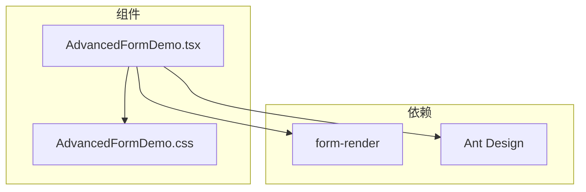
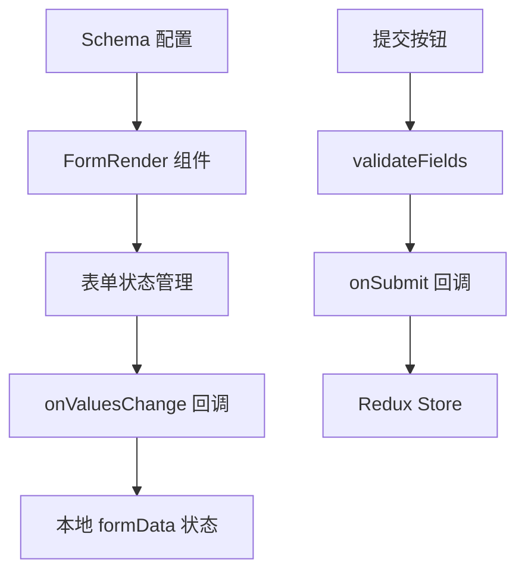
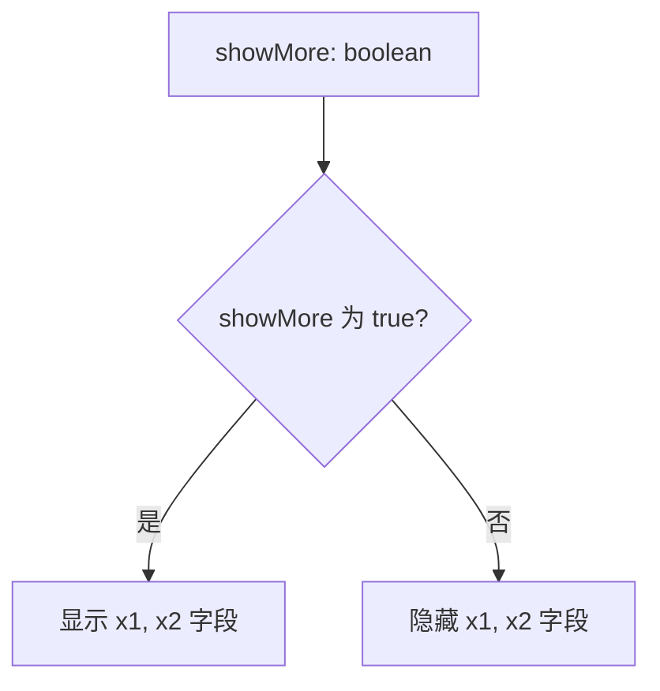
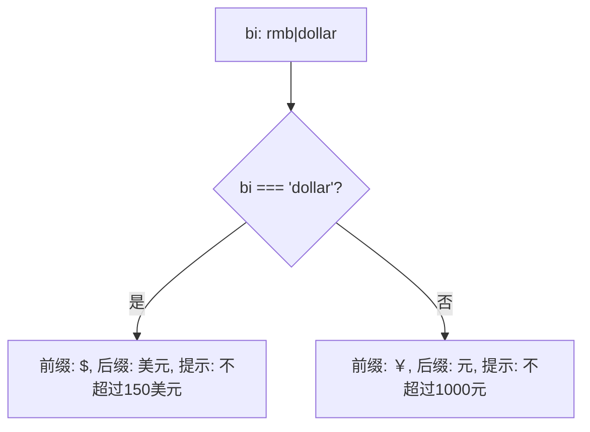
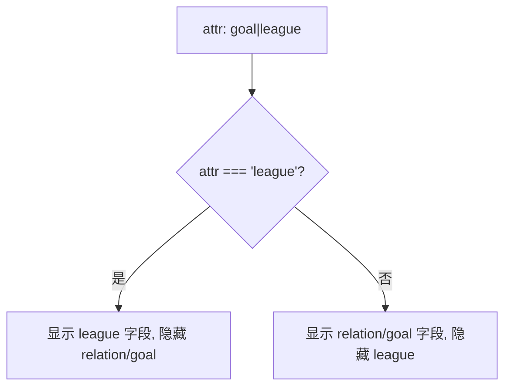
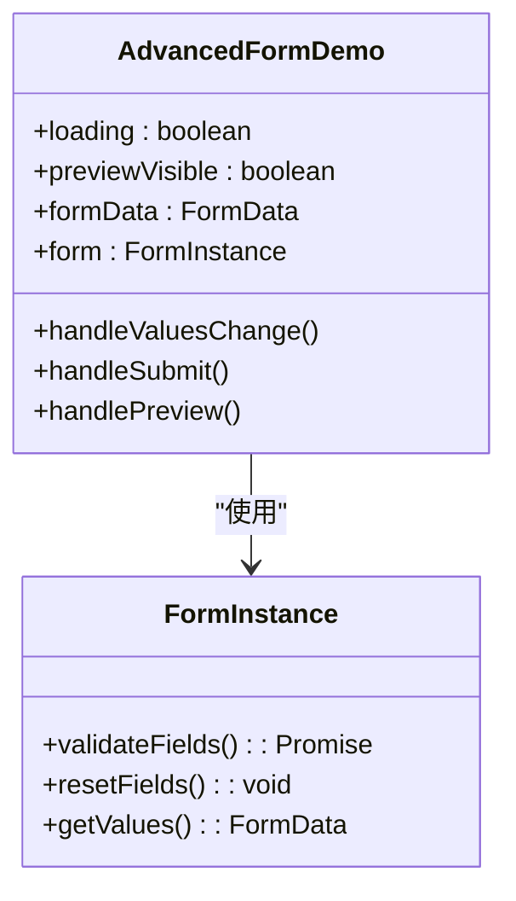
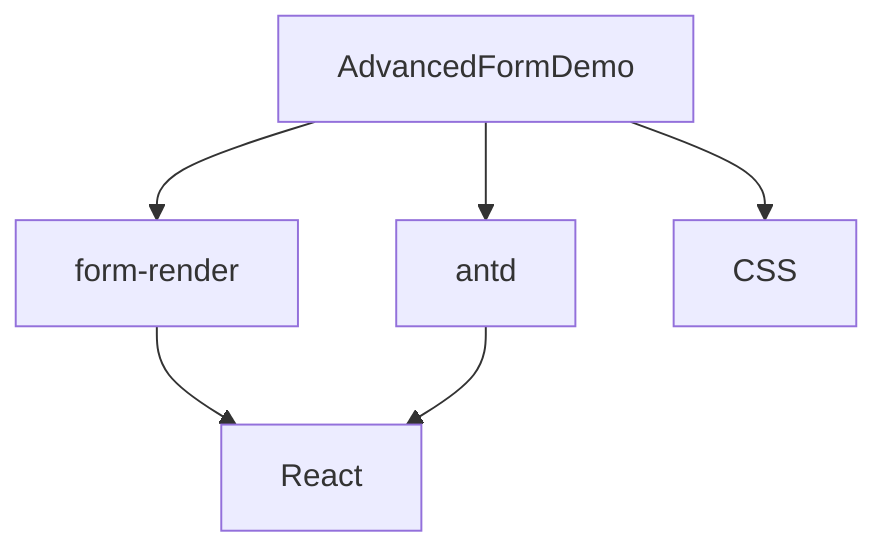

# AdvancedFormDemo 组件

<cite>
**本文档引用文件**  
- [AdvancedFormDemo.tsx](file://src/components/advanced-form/AdvancedFormDemo.tsx)
- [AdvancedFormDemo.css](file://src/components/advanced-form/AdvancedFormDemo.css)
- [App.tsx](file://src/App.tsx)
- [TYPE_DEFINITIONS.md](file://TYPE_DEFINITIONS.md)
- [FIELD_INTERACTIONS.md](file://FIELD_INTERACTIONS.md)
</cite>

## 目录
1. [简介](#简介)
2. [项目结构](#项目结构)
3. [核心组件](#核心组件)
4. [架构概览](#架构概览)
5. [详细组件分析](#详细组件分析)
6. [依赖分析](#依赖分析)
7. [性能考虑](#性能考虑)
8. [故障排除指南](#故障排除指南)
9. [结论](#结论)

## 简介
AdvancedFormDemo 是一个基于 `form-render` 的动态表单演示组件，用于展示复杂表单的字段联动、条件显示和状态管理功能。该组件通过 Schema 配置实现字段的动态隐藏、选项联动（如币种选择影响输入框前缀）和列表项条件渲染（如根据筛选标准切换输入字段）。组件使用 `useForm` Hook 管理表单状态，并通过 `onValuesChange` 同步数据到本地状态 `formData`。表单数据可通过 `onSubmit` 回调提交至 Redux Store 进行全局状态管理。

## 项目结构
AdvancedFormDemo 组件位于 `src/components/advanced-form/` 目录下，包含 TypeScript 文件和 CSS 样式文件。组件通过 `form-render` 库实现动态表单功能，并依赖 Ant Design 组件库进行 UI 渲染。

**Diagram sources**
- [AdvancedFormDemo.tsx](file://src/components/advanced-form/AdvancedFormDemo.tsx#L1-L248)
- [AdvancedFormDemo.css](file://src/components/advanced-form/AdvancedFormDemo.css#L1-L77)

**Section sources**
- [AdvancedFormDemo.tsx](file://src/components/advanced-form/AdvancedFormDemo.tsx#L1-L248)
- [AdvancedFormDemo.css](file://src/components/advanced-form/AdvancedFormDemo.css#L1-L77)

## 核心组件
AdvancedFormDemo 组件通过 `FormData` 接口定义表单数据结构，并通过 `AdvancedFormDemoProps` 定义组件属性。组件使用 `useState` 管理加载状态、预览弹窗状态和表单数据，通过 `useForm` 创建表单实例。

**Section sources**
- [AdvancedFormDemo.tsx](file://src/components/advanced-form/AdvancedFormDemo.tsx#L6-L38)

## 架构概览
组件采用声明式 Schema 配置方式定义表单结构，通过表达式实现字段联动和条件显示。表单数据通过 `onValuesChange` 回调同步到本地状态，并通过 `onSubmit` 提交至外部处理逻辑。

**Diagram sources**
- [AdvancedFormDemo.tsx](file://src/components/advanced-form/AdvancedFormDemo.tsx#L50-L168)

## 详细组件分析

### 功能案例分析
AdvancedFormDemo 实现了三种主要的表单联动场景：整体隐藏、选项联动和列表项联动。

#### 案例1：整体隐藏
通过开关控制字段的显示/隐藏，使用 `hidden: "{{!formData.case1.showMore}}"` 表达式实现条件渲染。

**Diagram sources**
- [AdvancedFormDemo.tsx](file://src/components/advanced-form/AdvancedFormDemo.tsx#L70-L84)

#### 案例2：选项联动
根据币种选择动态改变输入框的提示和装饰，使用三元运算符实现动态属性。

**Diagram sources**
- [AdvancedFormDemo.tsx](file://src/components/advanced-form/AdvancedFormDemo.tsx#L100-L116)

#### 案例3：列表项联动
根据筛选标准动态显示不同的输入组件，使用 `rootValue` 上下文实现数组项内的条件渲染。

**Diagram sources**
- [AdvancedFormDemo.tsx](file://src/components/advanced-form/AdvancedFormDemo.tsx#L140-L160)

### 状态管理分析
组件通过 `useForm` Hook 管理表单内部状态，并通过 `onValuesChange` 将表单值同步到本地 `formData` 状态。

**Diagram sources**
- [AdvancedFormDemo.tsx](file://src/components/advanced-form/AdvancedFormDemo.tsx#L39-L48)

**Section sources**
- [AdvancedFormDemo.tsx](file://src/components/advanced-form/AdvancedFormDemo.tsx#L39-L248)

## 依赖分析
AdvancedFormDemo 组件依赖 `form-render` 库实现动态表单功能，依赖 Ant Design 提供 UI 组件，并通过 CSS 文件进行样式定制。

**Diagram sources**
- [AdvancedFormDemo.tsx](file://src/components/advanced-form/AdvancedFormDemo.tsx#L1-L5)
- [AdvancedFormDemo.css](file://src/components/advanced-form/AdvancedFormDemo.css#L1-L77)

**Section sources**
- [AdvancedFormDemo.tsx](file://src/components/advanced-form/AdvancedFormDemo.tsx#L1-L248)
- [AdvancedFormDemo.css](file://src/components/advanced-form/AdvancedFormDemo.css#L1-L77)

## 性能考虑
组件通过 `form-render` 的优化机制实现高效的表单渲染，避免不必要的重渲染。条件显示使用表达式计算而非手动状态管理，减少了组件的复杂度和潜在的性能问题。

## 故障排除指南
### 动态字段不更新
- 检查表达式语法是否正确
- 确认字段路径引用准确（`formData.caseX.fieldY`）
- 验证 `onValuesChange` 是否正确同步数据

### 验证失败
- 检查 Schema 中的 `rules` 配置
- 确认正则表达式模式正确
- 验证 `required` 字段是否被正确标记

### 样式问题
- 检查 CSS 类名是否正确应用
- 确认 Ant Design 样式已正确导入
- 验证响应式断点设置

**Section sources**
- [AdvancedFormDemo.tsx](file://src/components/advanced-form/AdvancedFormDemo.tsx#L169-L224)
- [AdvancedFormDemo.css](file://src/components/advanced-form/AdvancedFormDemo.css#L1-L77)

## 结论
AdvancedFormDemo 组件通过声明式 Schema 配置和表达式驱动的联动机制，实现了复杂的表单交互功能。组件设计合理，状态管理清晰，易于集成到 Redux 架构中，为复杂表单场景提供了高效的解决方案。