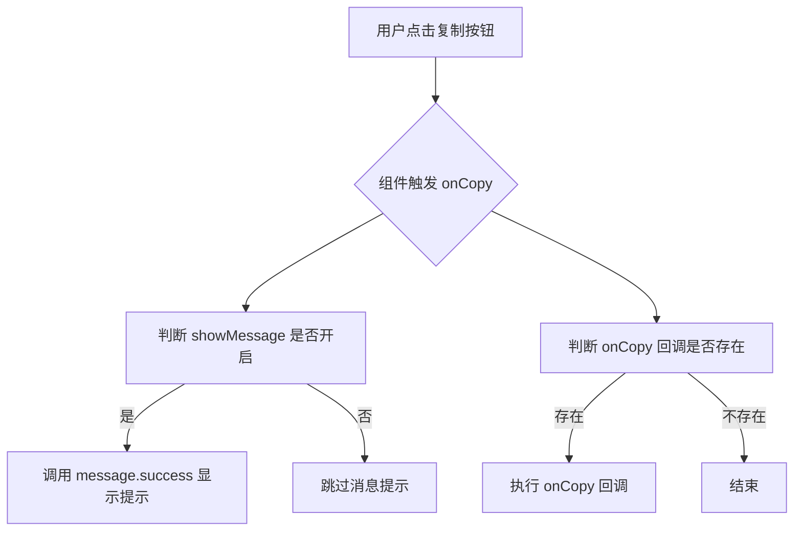
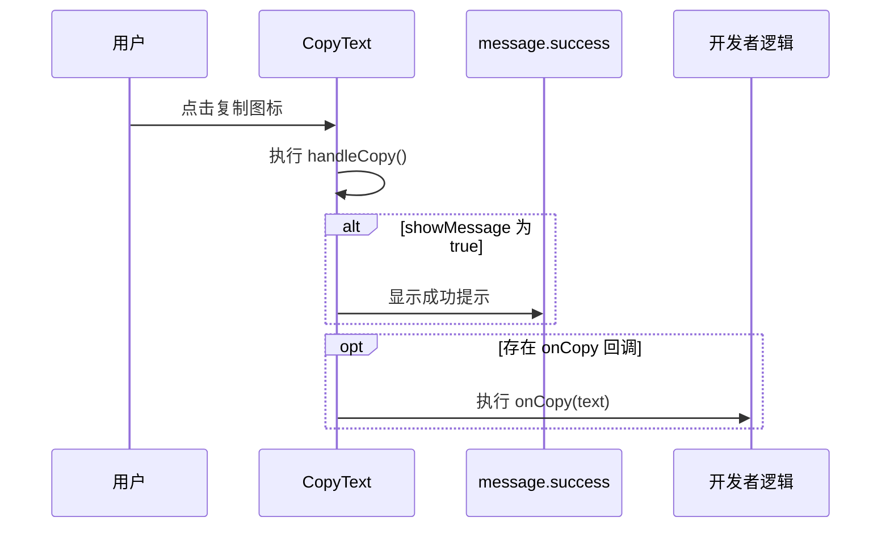
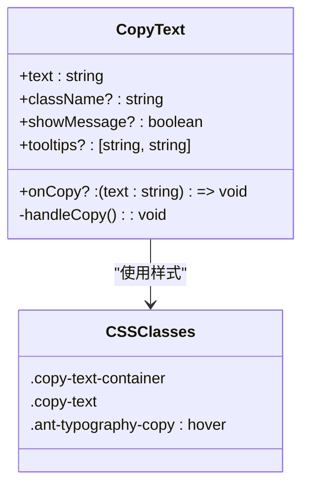

# CopyText 组件

<cite>
**本文档引用文件**  
- [CopyText.tsx](file://src/components/copy-text/CopyText.tsx)
- [CopyText.css](file://src/components/copy-text/CopyText.css)
- [DualFieldTable.tsx](file://src/components/dual-field-table/DualFieldTable.tsx)
</cite>

## 目录
1. [简介](#简介)
2. [核心功能与实现机制](#核心功能与实现机制)
3. [Props 接口文档](#props-接口文档)
4. [用户反馈与消息提示](#用户反馈与消息提示)
5. [样式结构与自定义扩展](#样式结构与自定义扩展)
6. [使用示例](#使用示例)
7. [实际应用场景](#实际应用场景)
8. [常见问题与解决方案](#常见问题与解决方案)
9. [总结](#总结)

## 简介
CopyText 组件是一个轻量级、可复用的 React 组件，用于封装将文本复制到剪贴板的功能。该组件基于 Ant Design 的 `Typography.Text` 组件构建，通过其 `copyable` 属性实现复制能力，并支持高度自定义的交互逻辑和视觉反馈。它适用于需要提供便捷复制功能的场景，如展示邮箱、电话号码、代码片段等。

该组件设计简洁，易于集成，具备良好的类型安全（TypeScript 支持），并已在 `DualFieldTable` 组件中得到实际应用。

**Section sources**  
- [CopyText.tsx](file://src/components/copy-text/CopyText.tsx#L1-L51)

## 核心功能与实现机制
CopyText 的核心功能是通过 Ant Design 的 `Typography.Text` 组件的 `copyable` 属性触发复制操作。当用户点击复制图标时，会执行预设的 `onCopy` 回调函数。

在内部实现中，组件定义了一个 `handleCopy` 函数，该函数在复制操作触发时被调用：
- 若 `showMessage` 为 `true`，则通过 `message.success` 显示成功提示。
- 若提供了 `onCopy` 回调，则执行该回调并传入当前文本内容。

此机制允许开发者在不修改组件源码的情况下，自定义复制成功后的所有行为。



**Diagram sources**  
- [CopyText.tsx](file://src/components/copy-text/CopyText.tsx#L25-L37)

**Section sources**  
- [CopyText.tsx](file://src/components/copy-text/CopyText.tsx#L25-L37)

## Props 接口文档
以下是 CopyText 组件支持的所有属性（Props）及其说明：

| 属性名 | 类型 | 默认值 | 说明 |
|-------|------|--------|------|
| `text` | `string` | 必填 | 要复制的文本内容 |
| `className` | `string` | `""` | 自定义 CSS 类名，用于样式扩展 |
| `showMessage` | `boolean` | `false` | 是否在复制成功后显示默认成功消息 |
| `tooltips` | `[string, string]` | `["点击复制", "已复制"]` | 复制按钮的提示文案数组，分别为未复制和已复制状态下的提示 |
| `onCopy` | `(text: string) => void` | `undefined` | 复制成功后的回调函数，接收复制的文本作为参数 |

这些属性使得组件具有高度灵活性，既能满足基本需求，也能支持复杂交互。

**Section sources**  
- [CopyText.tsx](file://src/components/copy-text/CopyText.tsx#L7-L18)

## 用户反馈与消息提示
CopyText 组件通过 Ant Design 的 `message` 组件提供用户反馈。当 `showMessage` 属性设置为 `true` 时，复制成功后会自动调用 `message.success` 方法，显示格式为 `"已复制: {text}"` 的提示信息。

开发者也可以完全自定义此行为，通过 `onCopy` 回调实现更复杂的反馈机制，例如：
- 发送埋点日志
- 更新 UI 状态
- 触发其他业务逻辑

这确保了组件既开箱即用，又不失扩展性。



**Diagram sources**  
- [CopyText.tsx](file://src/components/copy-text/CopyText.tsx#L29-L35)

## 样式结构与自定义扩展
CopyText 组件的样式结构清晰，便于扩展和定制。

主要 CSS 类包括：
- `.copy-text-container`：外层容器，使用 `inline-flex` 布局，确保文本与复制图标对齐。
- `.copy-text`：应用于 `Typography.Text` 的类，设置 `word-break: break-all` 以支持长文本换行。
- `.ant-typography-copy`：Ant Design 的复制图标类，通过 CSS 控制其默认隐藏，仅在容器悬停时显示，提升界面整洁度。

开发者可通过 `className` 属性传入自定义类名，进一步扩展样式，例如添加边距、颜色或动画效果。



**Diagram sources**  
- [CopyText.css](file://src/components/copy-text/CopyText.css#L1-L20)

**Section sources**  
- [CopyText.css](file://src/components/copy-text/CopyText.css#L1-L32)

## 使用示例
以下是如何在不同场景中使用 CopyText 组件的示例：

### 基本用法
```tsx
<CopyText text="hello@example.com" showMessage={true} />
```

### 自定义提示文案
```tsx
<CopyText 
  text="18612345678" 
  tooltips={["点击复制电话", "电话已复制"]} 
/>
```

### 自定义回调行为
```tsx
<CopyText 
  text="secret-token-123" 
  onCopy={(text) => {
    console.log("复制了敏感信息:", text);
    // 可在此处添加加密日志或权限审计
  }}
/>
```

### 在表格中使用（结合 DualFieldTable）
```tsx
<CopyText text={record.field1} showMessage={true} />
```

**Section sources**  
- [CopyText.tsx](file://src/components/copy-text/CopyText.tsx#L40-L50)
- [DualFieldTable.tsx](file://src/components/dual-field-table/DualFieldTable.tsx#L80-L84)

## 实际应用场景
CopyText 组件已在 `DualFieldTable` 中成功应用，用于展示用户的联系信息（如邮箱和电话号码）。在该表格中，每个用户的两项联系信息分别通过两个 CopyText 实例展示，支持一键复制。

这种设计提升了用户体验，特别是在数据密集型界面中，用户无需手动选择和复制文本，提高了操作效率。

此外，该组件也适用于以下场景：
- 用户资料卡片
- API 密钥管理页面
- 日志查看器
- 配置信息展示

**Section sources**  
- [DualFieldTable.tsx](file://src/components/dual-field-table/DualFieldTable.tsx#L72-L90)

## 常见问题与解决方案
### 问题1：复制功能未生效
**原因**：浏览器安全策略限制或剪贴板 API 不可用。  
**解决方案**：确保页面运行在 HTTPS 环境下，或在本地开发时使用 `localhost`。

### 问题2：消息提示重复显示
**原因**：多次渲染组件或事件绑定重复。  
**解决方案**：检查父组件是否频繁重渲染，或确保 `onCopy` 回调无副作用。

### 问题3：复制图标不显示
**原因**：CSS 样式被覆盖或未正确加载。  
**解决方案**：确认 `CopyText.css` 已正确引入，且无全局样式冲突。

### 问题4：长文本换行异常
**原因**：缺少 `word-break` 样式。  
**解决方案**：组件已内置 `.copy-text { word-break: break-all }`，确保未被覆盖。

**Section sources**  
- [CopyText.tsx](file://src/components/copy-text/CopyText.tsx#L25-L37)
- [CopyText.css](file://src/components/copy-text/CopyText.css#L7-L12)

## 总结
CopyText 组件是一个功能完整、设计精巧的可复用组件，基于 Ant Design 实现了文本复制的核心功能。它通过 `copyable` 属性和 `onCopy` 回调机制，实现了灵活的交互控制，并通过 `message.success` 提供默认反馈。组件支持自定义提示、样式扩展和回调逻辑，适用于多种业务场景。

其轻量级设计和良好的类型支持使其易于集成和维护，已在 `DualFieldTable` 中验证了实用性。通过合理使用该组件，可以显著提升用户在数据展示类界面中的操作体验。