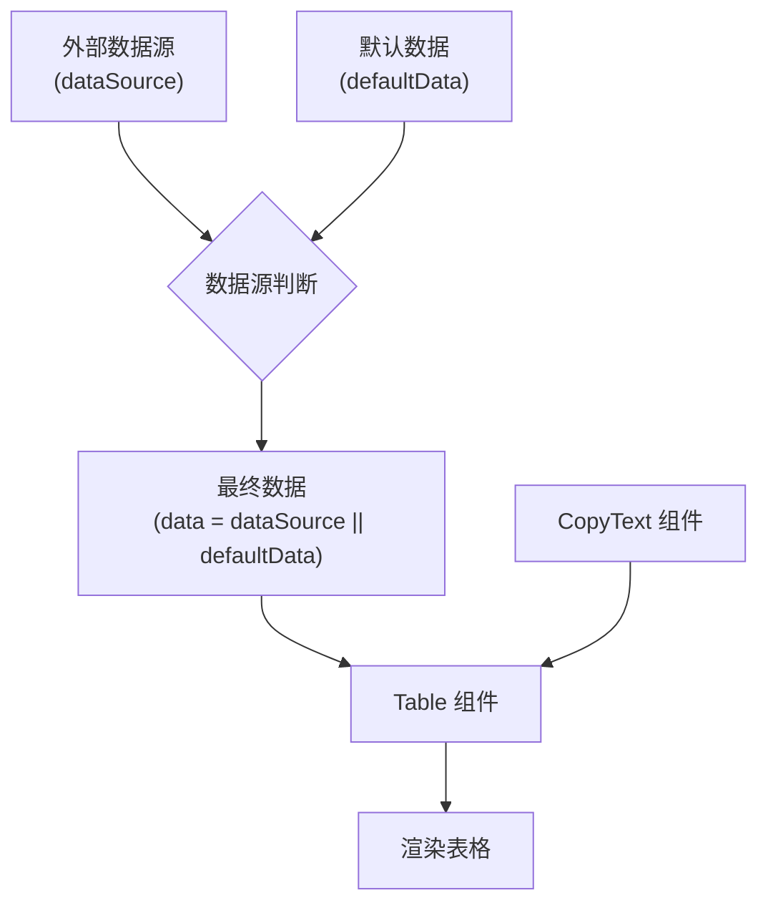
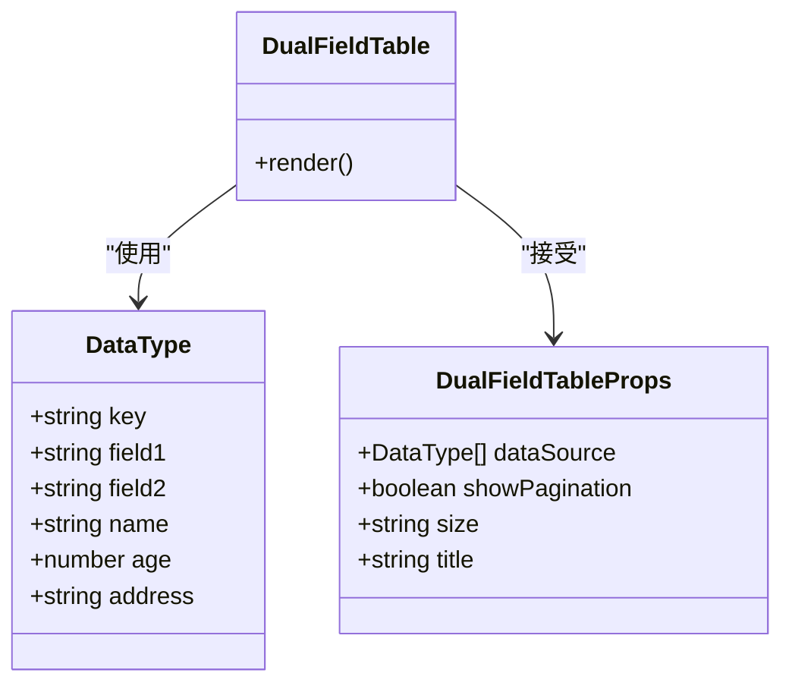
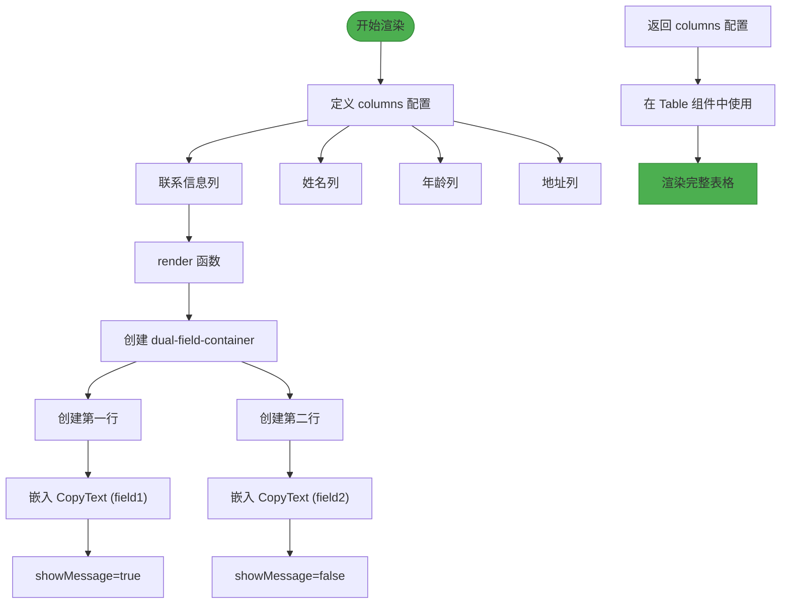
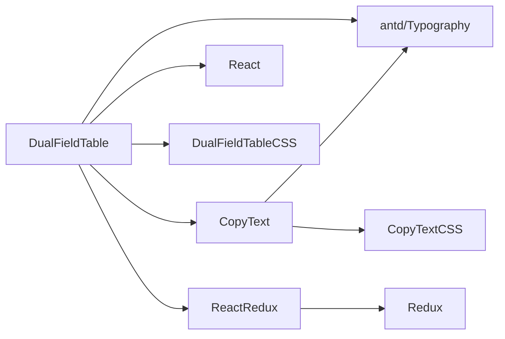

# DualFieldTable 组件

<cite>
**本文档引用的文件**  
- [DualFieldTable.tsx](file://src/components/dual-field-table/DualFieldTable.tsx)
- [DualFieldTable.css](file://src/components/dual-field-table/DualFieldTable.css)
- [CopyText.tsx](file://src/components/copy-text/CopyText.tsx)
- [TYPE_DEFINITIONS.md](file://TYPE_DEFINITIONS.md)
- [react-redux.ts](file://src/redux/react-redux.ts)
</cite>

## 目录
1. [简介](#简介)
2. [项目结构](#项目结构)
3. [核心组件](#核心组件)
4. [架构概述](#架构概述)
5. [详细组件分析](#详细组件分析)
6. [依赖分析](#依赖分析)
7. [性能考虑](#性能考虑)
8. [故障排除指南](#故障排除指南)
9. [结论](#结论)

## 简介
DualFieldTable 组件是一个用于展示成对联系信息的表格组件，典型应用于显示邮箱和电话等双字段数据。该组件基于 Ant Design 的 Table 组件构建，通过组合 CopyText 组件实现字段内容的可复制性，体现了组合式设计思想。组件支持自定义数据源、分页、尺寸和标题等配置选项，并提供了默认数据机制。

## 项目结构
项目结构清晰，组件按功能模块化组织。DualFieldTable 组件位于 `src/components/dual-field-table/` 目录下，依赖 CopyText 组件实现复制功能。样式文件独立管理，类型定义完整，支持 TypeScript 类型安全开发。

```mermaid
graph TB
subgraph "Components"
DualFieldTable["dual-field-table/DualFieldTable.tsx"]
CopyText["copy-text/CopyText.tsx"]
end
subgraph "Styles"
DualFieldTableCSS["dual-field-table/DualFieldTable.css"]
CopyTextCSS["copy-text/CopyText.css"]
end
subgraph "Redux"
ReactRedux["redux/react-redux.ts"]
Redux["redux/redux.ts"]
end
DualFieldTable --> CopyText
DualFieldTable --> DualFieldTableCSS
CopyText --> CopyTextCSS
DualFieldTable --> ReactRedux
```

**Diagram sources**
- [DualFieldTable.tsx](file://src/components/dual-field-table/DualFieldTable.tsx#L1-L128)
- [CopyText.tsx](file://src/components/copy-text/CopyText.tsx#L1-L52)

**Section sources**
- [DualFieldTable.tsx](file://src/components/dual-field-table/DualFieldTable.tsx#L1-L128)
- [project_structure](file://#L1-L20)

## 核心组件
DualFieldTable 组件的核心设计是使用 Ant Design 的 Table 组件构建表格结构，并在“联系信息”列中嵌套 CopyText 组件以实现字段的可复制性。组件定义了明确的数据模型（DataType 接口）和配置属性（DualFieldTableProps），支持灵活的数据展示和交互。

**Section sources**
- [DualFieldTable.tsx](file://src/components/dual-field-table/DualFieldTable.tsx#L9-L36)
- [TYPE_DEFINITIONS.md](file://TYPE_DEFINITIONS.md#L66-L96)

## 架构概述
DualFieldTable 组件采用组合式架构，通过集成 Ant Design 的 Table 和自定义的 CopyText 组件，实现了功能丰富且可复用的表格展示组件。数据流优先使用传入的 dataSource，若未提供则使用内置的默认数据。



**Diagram sources**
- [DualFieldTable.tsx](file://src/components/dual-field-table/DualFieldTable.tsx#L38-L73)

## 详细组件分析

### DualFieldTable 组件分析
DualFieldTable 组件通过定义 DataType 接口描述数据结构，包括 key、field1、field2、name、age 和 address 字段。DualFieldTableProps 接口定义了组件的可配置属性：dataSource（数据源）、showPagination（是否显示分页）、size（表格大小）和 title（标题）。

#### 数据模型与属性定义


**Diagram sources**
- [DualFieldTable.tsx](file://src/components/dual-field-table/DualFieldTable.tsx#L9-L36)

#### 渲染逻辑分析


**Diagram sources**
- [DualFieldTable.tsx](file://src/components/dual-field-table/DualFieldTable.tsx#L72-L127)

**Section sources**
- [DualFieldTable.tsx](file://src/components/dual-field-table/DualFieldTable.tsx#L38-L128)

### 样式定制分析
DualFieldTable 组件提供了 CSS 类名用于样式定制，包括 dual-field-container 和 dual-field-row 类，允许开发者自定义布局和外观。

```mermaid
classDiagram
class "DualFieldTable.css" {
.dual-field-table
.dual-field-table h2
.dual-field-table .ant-table-tbody > tr > td
.dual-field-table .ant-table-tbody > tr > td : first-child
}
class "DualFieldTable.tsx" {
<div className="dual-field-container">
<div className="dual-field-row">
}
"DualFieldTable.css" --> "DualFieldTable.tsx" : "样式应用"
```

**Diagram sources**
- [DualFieldTable.css](file://src/components/dual-field-table/DualFieldTable.css#L1-L18)

## 依赖分析
DualFieldTable 组件依赖多个内部和外部模块，形成了清晰的依赖关系网络。



**Diagram sources**
- [DualFieldTable.tsx](file://src/components/dual-field-table/DualFieldTable.tsx#L1-L10)
- [react-redux.ts](file://src/redux/react-redux.ts#L1-L18)

**Section sources**
- [DualFieldTable.tsx](file://src/components/dual-field-table/DualFieldTable.tsx#L1-L128)
- [react-redux.ts](file://src/redux/react-redux.ts#L1-L18)

## 性能考虑
对于大数据量场景，建议启用 showPagination 属性以实现分页处理，避免一次性渲染过多数据导致性能问题。在极端情况下，可考虑结合虚拟滚动技术优化渲染性能。

**Section sources**
- [DualFieldTable.tsx](file://src/components/dual-field-table/DualFieldTable.tsx#L45-L48)

## 故障排除指南
当 DualFieldTable 未正确显示数据时，请检查 dataSource 是否符合 DataType 接口结构。若复制功能失效，请确认 CopyText 组件的 text 属性是否正确传递。样式问题可检查 CSS 类名是否正确应用。

**Section sources**
- [DualFieldTable.tsx](file://src/components/dual-field-table/DualFieldTable.tsx#L72-L127)
- [CopyText.tsx](file://src/components/copy-text/CopyText.tsx#L10-L25)

## 结论
DualFieldTable 组件通过组合式设计思想，有效集成了表格展示和内容复制功能，提供了灵活的配置选项和良好的用户体验。组件类型定义完整，支持 TypeScript 类型安全，适用于 Redux 等状态管理架构，是可复用的高质量 UI 组件。