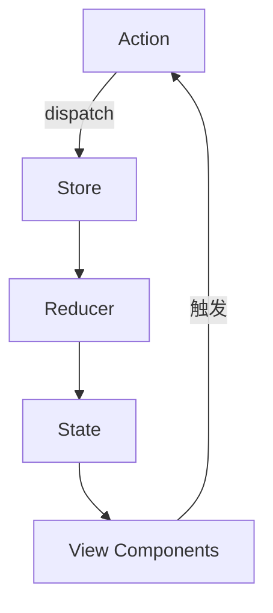
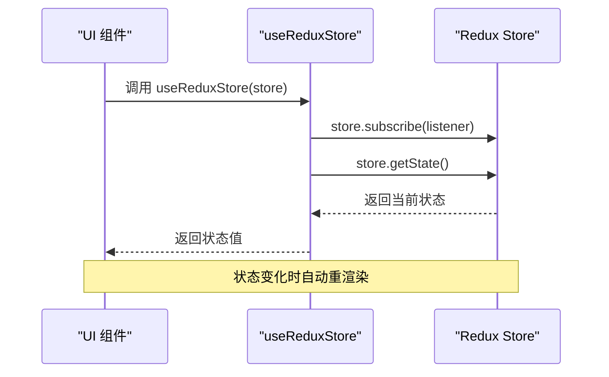

<cite>
**本文档中引用的文件**  
- [AdvancedFormDemo.tsx](file://src/components/advanced-form/AdvancedFormDemo.tsx)
- [CopyText.tsx](file://src/components/copy-text/CopyText.tsx)
- [DualFieldTable.tsx](file://src/components/dual-field-table/DualFieldTable.tsx)
- [App.tsx](file://src/App.tsx)
- [redux.ts](file://src/redux/redux.ts)
- [react-redux.ts](file://src/redux/react-redux.ts)
</cite>

## 目录
1. [简介](#简介)
2. [AdvancedFormDemo 组件](#advancedformdemo-组件)
3. [CopyText 组件](#copytext-组件)
4. [DualFieldTable 组件](#dualfieldtable-组件)
5. [状态管理与 Redux 集成](#状态管理与-redux-集成)
6. [组件使用场景示例](#组件使用场景示例)
7. [样式定制方法](#样式定制方法)

## 简介
本文档全面介绍项目中的三个核心 UI 功能组件：AdvancedFormDemo、CopyText 和 DualFieldTable。这些组件共同构成了一个现代化的 React 应用界面体系，通过 TypeScript 提供类型安全，并利用 Redux 实现状态与视图的分离。文档将详细说明每个组件的功能特点、接口定义、使用方式和样式定制方法，重点阐述它们如何通过 Redux 进行统一的状态管理。

## AdvancedFormDemo 组件

AdvancedFormDemo 是一个复杂的动态表单演示组件，展示了字段联动、状态管理和提交处理等高级功能。该组件基于 `form-render` 库构建，通过声明式的 Schema 定义实现强大的表单逻辑控制。

### Props 接口定义
```typescript
interface AdvancedFormDemoProps {
  /** 表单提交回调函数 */
  onSubmit?: (data: FormData) => Promise<void>;
  /** 初始表单数据 */
  initialData?: FormData;
}
```

其中 `FormData` 类型定义了表单的完整数据结构，包含多个嵌套对象，如 `case1`、`case2` 和 `case3`，分别对应不同的表单案例。

### 功能特点
- **字段联动**：通过 Schema 中的 `hidden` 字段使用表达式 `{{!formData.case1.showMore}}` 实现条件显示/隐藏。
- **选项联动**：根据币种选择（人民币/美元）动态改变输入框的前缀、后缀和提示信息。
- **列表项联动**：在数组项中，根据“筛选标准”选择“入球数”或“所在联盟”，动态显示相应的输入组件。

### 状态管理
组件使用 `useState` 管理本地状态，包括 `loading`、`previewVisible` 和 `formData`。表单值的变化通过 `handleValuesChange` 回调同步到 `formData` 状态中。

### 提交处理逻辑
提交流程包括：
1. 调用 `form.validateFields()` 进行表单验证
2. 设置 `loading` 状态为 `true`
3. 执行 `onSubmit` 回调函数处理提交数据
4. 捕获异常并记录错误
5. 最终将 `loading` 状态重置为 `false`

**Section sources**
- [AdvancedFormDemo.tsx](file://src/components/advanced-form/AdvancedFormDemo.tsx#L20-L246)

## CopyText 组件

CopyText 组件提供了一种便捷的文本复制到剪贴板的功能，封装了 Ant Design 的 `Typography.Text` 组件的复制功能，增强了用户体验。

### Props 接口定义
```typescript
interface CopyTextProps {
  /** 要复制的文本内容 */
  text: string;
  /** 自定义 CSS 类名 */
  className?: string;
  /** 是否显示复制成功消息 */
  showMessage?: boolean;
  /** 自定义提示文本 */
  tooltips?: [string, string];
  /** 复制成功的回调函数 */
  onCopy?: (text: string) => void;
}
```

### 功能机制
组件通过 Ant Design 的 `copyable` 属性实现复制功能，当用户点击复制图标时，触发 `handleCopy` 函数。该函数会根据 `showMessage` 参数决定是否显示成功消息，并调用 `onCopy` 回调通知父组件。

### 用户交互设计
- 鼠标悬停时显示复制图标（通过 CSS 控制 `opacity`）
- 支持自定义提示文本（默认为“点击复制”和“已复制”）
- 可配置是否显示成功消息提示

**Section sources**
- [CopyText.tsx](file://src/components/copy-text/CopyText.tsx#L8-L51)

## DualFieldTable 组件

DualFieldTable 组件是一个专门用于展示双字段信息的表格组件，典型应用场景如同时展示邮箱和电话号码。

### Props 接口定义
```typescript
interface DualFieldTableProps {
  /** 表格数据 */
  dataSource?: DataType[];
  /** 是否显示分页 */
  showPagination?: boolean;
  /** 表格大小 */
  size?: "small" | "middle" | "large";
  /** 表格标题 */
  title?: string;
}
```

### 布局结构
组件采用 Ant Design 的 `Table` 组件构建，第一列“联系信息”使用自定义 `render` 函数，通过 `dual-field-container` 和 `dual-field-row` CSS 类实现垂直堆叠布局，确保两个字段清晰分隔。

### 数据管理方式
- 支持传入 `dataSource` 作为外部数据源
- 若未提供数据，则使用内置的 `defaultData` 示例数据
- 每行数据包含 `key`、`field1`、`field2` 等字段，便于表格渲染

**Section sources**
- [DualFieldTable.tsx](file://src/components/dual-field-table/DualFieldTable.tsx#L13-L127)

## 状态管理与 Redux 集成

尽管当前组件主要使用本地状态管理，但项目已完整集成 Redux 状态管理机制，体现了状态与视图分离的设计思想。

### Redux 核心实现
`redux.ts` 文件实现了 Redux 的核心概念：
- `createStore`：创建 Store 实例
- `combineReducers`：合并多个 Reducer
- `applyMiddleware`：应用中间件（如日志和异步支持）
- `thunkMiddleware`：支持异步 Action



**Diagram sources**
- [redux.ts](file://src/redux/redux.ts#L1-L176)

### React-Redux 集成
`react-redux.ts` 文件通过 `useReduxStore` Hook 将 React 与 Redux 连接：
- 使用 React 18 的 `useSyncExternalStore` 实现高效的状态同步
- 订阅 Store 变化并触发组件重渲染
- 提供类型安全的 Store 访问接口



**Diagram sources**
- [react-redux.ts](file://src/redux/react-redux.ts#L1-L19)

### 状态分离设计
通过将状态管理逻辑从 UI 组件中抽离，实现了：
- **关注点分离**：UI 组件专注于视图渲染，Redux 管理全局状态
- **可维护性**：状态变更逻辑集中管理，易于调试和测试
- **可扩展性**：新增功能时可轻松扩展 Reducer 和 Action

**Section sources**
- [redux.ts](file://src/redux/redux.ts#L1-L176)
- [react-redux.ts](file://src/redux/react-redux.ts#L1-L19)

## 组件使用场景示例

### AdvancedFormDemo 使用示例
```tsx
<AdvancedFormDemo 
  initialData={{ case1: { showMore: true } }}
  onSubmit={async (data) => {
    console.log('提交数据:', data);
    // 发送至服务器
  }} 
/>
```

### CopyText 使用示例
```tsx
<CopyText 
  text="hello@example.com" 
  showMessage={true} 
  tooltips={["点击复制邮箱", "邮箱已复制"]}
/>
```

### DualFieldTable 使用示例
```tsx
<DualFieldTable 
  dataSource={userData}
  title="用户联系信息"
  size="large"
/>
```

**Section sources**
- [App.tsx](file://src/App.tsx#L1-L33)

## 样式定制方法

### CSS 类名覆盖
所有组件均提供 `className` Prop，允许外部样式覆盖：
- `AdvancedFormDemo`：可通过类名定制卡片和表单样式
- `CopyText`：支持自定义容器样式
- `DualFieldTable`：可调整表格整体外观

### 内联样式
支持通过内联样式进一步定制：
```tsx
<CopyText text="text" style={{ fontSize: '16px' }} />
```

### CSS 变量
建议在项目中定义 CSS 变量以实现主题化：
```css
:root {
  --primary-color: #1890ff;
  --border-radius: 8px;
}
```

**Section sources**
- [AdvancedFormDemo.css](file://src/components/advanced-form/AdvancedFormDemo.css#L1-L76)
- [CopyText.css](file://src/components/copy-text/CopyText.css#L1-L32)
- [DualFieldTable.css](file://src/components/dual-field-table/DualFieldTable.css#L1-L18)