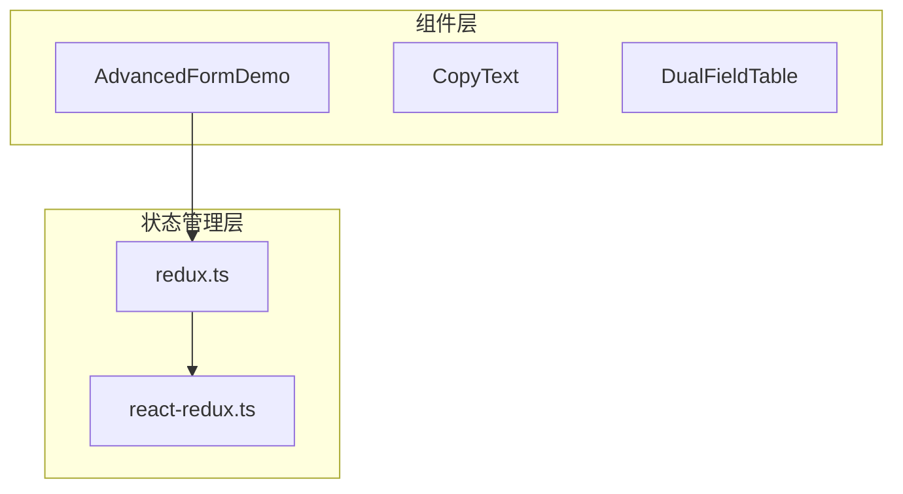
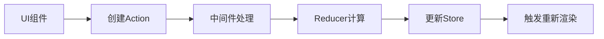
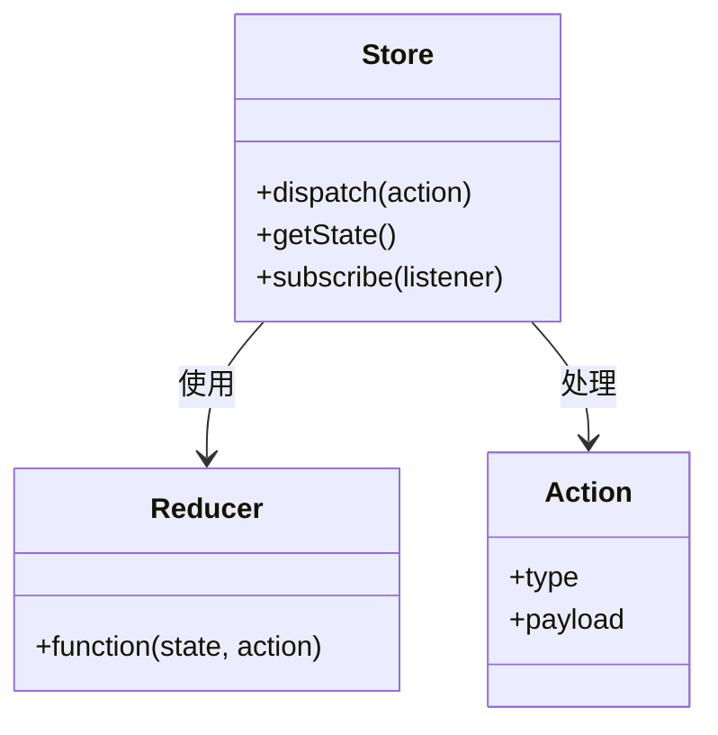
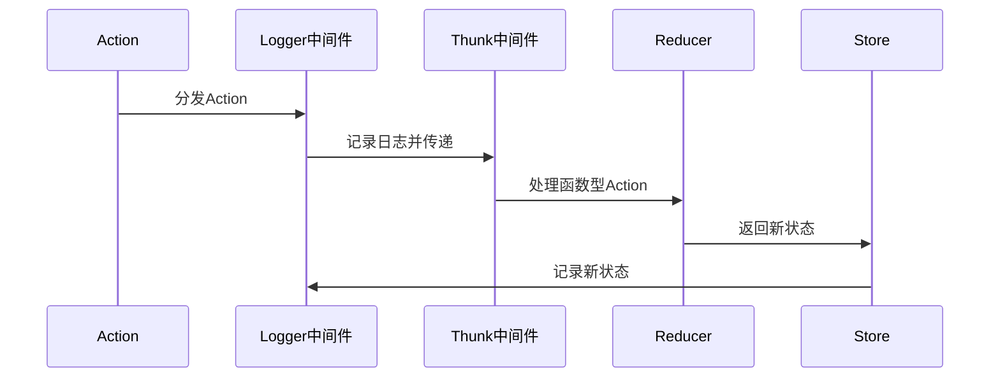
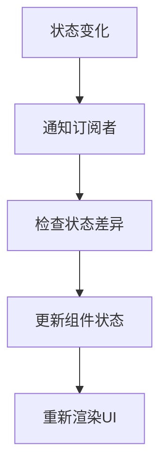
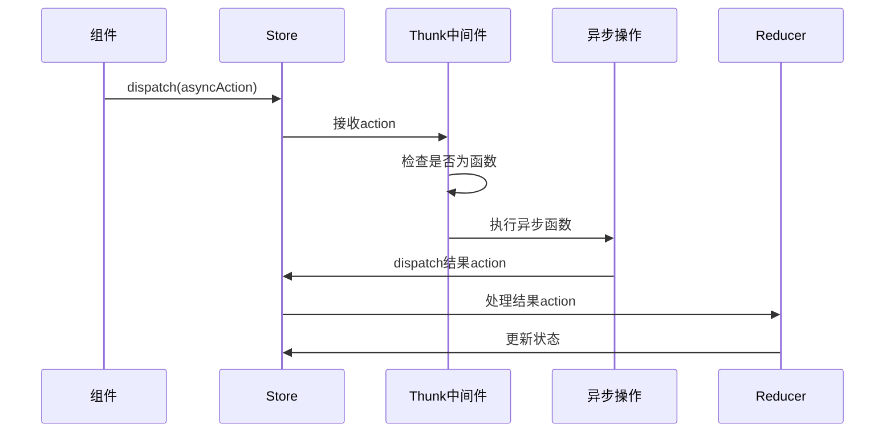

# 数据流详解

<cite>
**本文档引用的文件**  
- [AdvancedFormDemo.tsx](file://src/components/advanced-form/AdvancedFormDemo.tsx)
- [redux.ts](file://src/redux/redux.ts)
- [App.tsx](file://src/App.tsx)
- [react-redux.ts](file://src/redux/react-redux.ts)
</cite>

## 目录
1. [项目结构](#项目结构)
2. [核心数据流分析](#核心数据流分析)
3. [Redux 架构详解](#redux-架构详解)
4. [中间件机制剖析](#中间件机制剖析)
5. [状态更新与组件渲染](#状态更新与组件渲染)
6. [异步操作处理](#异步操作处理)
7. [总结](#总结)

## 项目结构

本项目采用清晰的模块化结构，主要分为组件和Redux状态管理两大部分。组件位于`src/components`目录下，其中`AdvancedFormDemo`是核心演示组件；Redux相关实现位于`src/redux`目录下，包含核心store逻辑和React集成。

**图示来源**  
- [AdvancedFormDemo.tsx](file://src/components/advanced-form/AdvancedFormDemo.tsx)
- [redux.ts](file://src/redux/redux.ts)
- [react-redux.ts](file://src/redux/react-redux.ts)

**本节来源**  
- [AdvancedFormDemo.tsx](file://src/components/advanced-form/AdvancedFormDemo.tsx)
- [redux.ts](file://src/redux/redux.ts)

## 核心数据流分析

在本项目中，数据流遵循Redux的经典单向流动模式。以`AdvancedFormDemo`组件为例，当用户与表单交互时，数据流经以下路径：UI组件 → Action创建 → Middleware处理 → Reducer计算 → Store更新 → 订阅者重新渲染。

**图示来源**  
- [AdvancedFormDemo.tsx](file://src/components/advanced-form/AdvancedFormDemo.tsx#L169-L224)
- [redux.ts](file://src/redux/redux.ts#L0-L54)

**本节来源**  
- [AdvancedFormDemo.tsx](file://src/components/advanced-form/AdvancedFormDemo.tsx)
- [redux.ts](file://src/redux/redux.ts)

## Redux 架构详解

项目中的Redux实现包含了完整的Store、Reducer、Action等核心概念。`createStore`函数创建了状态存储中心，通过`dispatch`方法接收action，`getState`获取当前状态，`subscribe`注册状态变化监听器。

**图示来源**  
- [redux.ts](file://src/redux/redux.ts#L0-L54)
- [redux.ts](file://src/redux/redux.ts#L144-L175)

**本节来源**  
- [redux.ts](file://src/redux/redux.ts)

## 中间件机制剖析

项目实现了logger和thunk两个关键中间件。logger中间件用于记录状态变化过程，thunk中间件处理异步操作。中间件通过`applyMiddleware`函数组合，形成处理链。

**图示来源**  
- [redux.ts](file://src/redux/redux.ts#L99-L151)
- [redux.ts](file://src/redux/redux.ts#L56-L104)

**本节来源**  
- [redux.ts](file://src/redux/redux.ts)

## 状态更新与组件渲染

当store状态更新时，通过`useReduxStore` Hook的`useSyncExternalStore`机制通知React组件重新渲染。`subscribe`方法注册监听器，在状态变化时触发组件更新。

**图示来源**  
- [react-redux.ts](file://src/redux/react-redux.ts#L0-L18)
- [redux.ts](file://src/redux/redux.ts#L56-L58)

**本节来源**  
- [react-redux.ts](file://src/redux/react-redux.ts)
- [redux.ts](file://src/redux/redux.ts)

## 异步操作处理

thunk中间件允许dispatch函数类型的action，从而处理异步操作。当遇到函数型action时，thunk会调用该函数并传入dispatch和getState，实现异步逻辑与状态管理的无缝集成。

**图示来源**  
- [redux.ts](file://src/redux/redux.ts#L144-L151)
- [redux.ts](file://src/redux/redux.ts#L99-L104)

**本节来源**  
- [redux.ts](file://src/redux/redux.ts)

## 总结

本项目展示了Redux单向数据流的完整实现。从UI组件发起action，经过中间件处理，到reducer计算新状态，最终更新store并触发视图更新，形成了一个可预测、可调试、易于测试的状态管理闭环。logger中间件提供了状态变化的可观测性，thunk中间件优雅地解决了异步操作的处理问题，共同构成了健壮的状态管理方案。