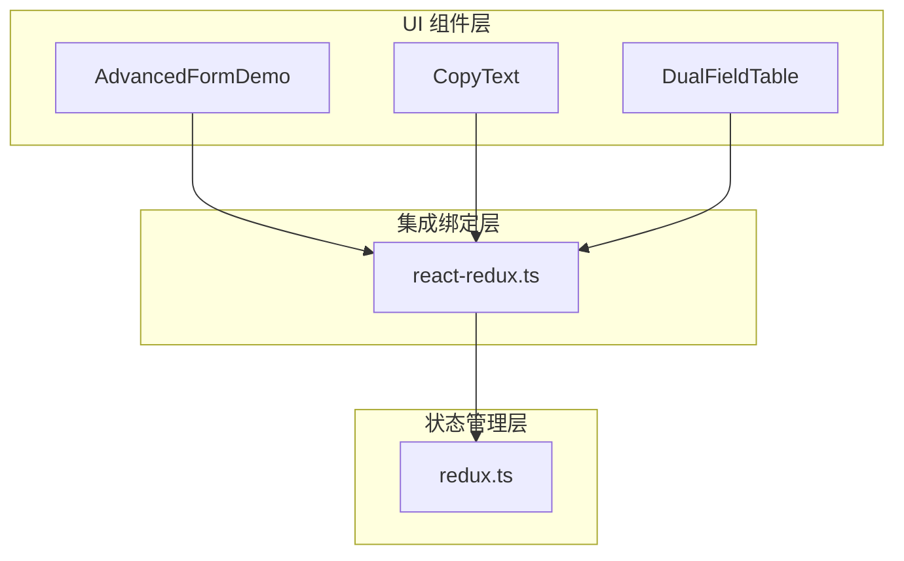
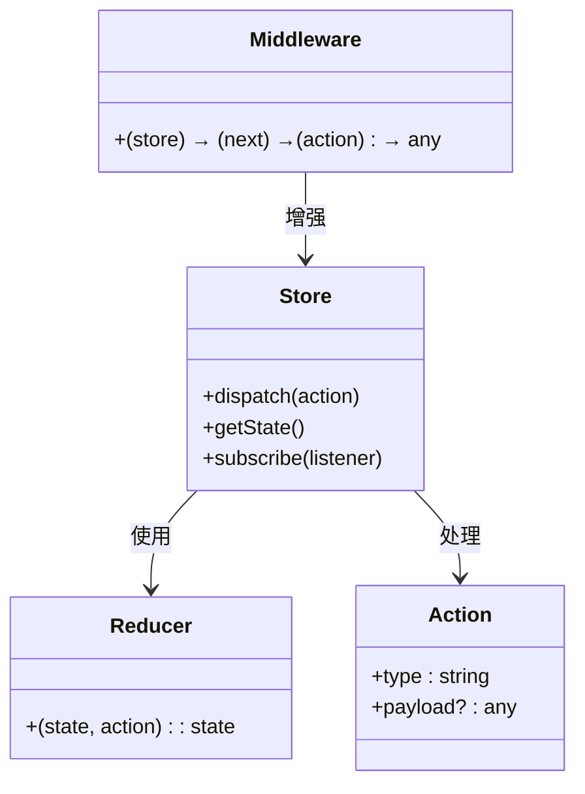
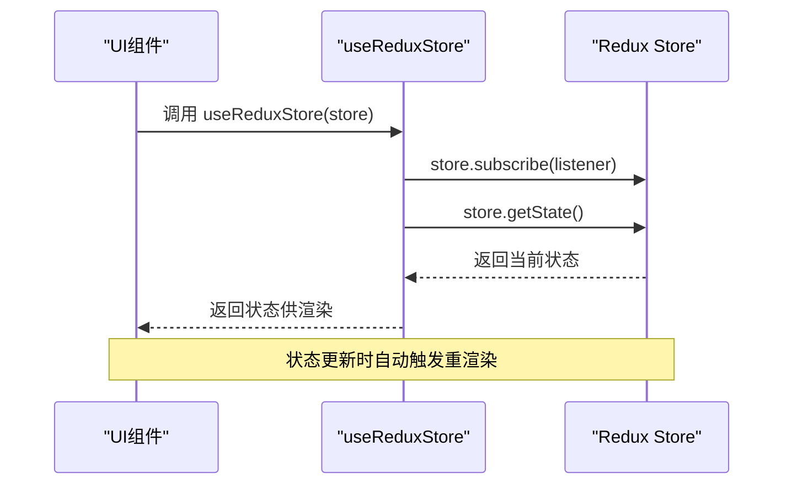

# 项目概述

<cite>
**本文档引用的文件**  
- [main.tsx](file://src/main.tsx)
- [App.tsx](file://src/App.tsx)
- [redux.ts](file://src/redux/redux.ts)
- [react-redux.ts](file://src/redux/react-redux.ts)
- [AdvancedFormDemo.tsx](file://src/components/advanced-form/AdvancedFormDemo.tsx)
- [CopyText.tsx](file://src/components/copy-text/CopyText.tsx)
- [DualFieldTable.tsx](file://src/components/dual-field-table/DualFieldTable.tsx)
- [README.md](file://README.md)
</cite>

## 目录
1. [项目背景与设计目标](#项目背景与设计目标)
2. [整体架构与技术愿景](#整体架构与技术愿景)
3. [核心功能模块详解](#核心功能模块详解)
4. [Redux 核心实现分析](#redux-核心实现分析)
5. [React 绑定机制解析](#react-绑定机制解析)
6. [学习价值与教学意义](#学习价值与教学意义)

## 项目背景与设计目标

`redux-demo` 项目旨在为开发者提供一个深入理解 Redux 状态管理机制的实践平台。该项目不仅演示了 Redux 的基本用法，更通过自实现的 Redux 核心逻辑，揭示其背后的设计哲学与运行原理。项目采用 React + TypeScript + Vite 技术栈构建，确保开发体验现代化且高效。

设计目标明确聚焦于教育性与可读性：通过精简但完整的代码结构，帮助开发者掌握单向数据流、Store、Reducer、Action 和 Middleware 等核心概念。项目不依赖外部 Redux 库，而是手动实现这些机制，使学习者能够“透视”框架内部运作，建立扎实的状态管理基础。

**Section sources**  
- [README.md](file://README.md#L1-L69)
- [main.tsx](file://src/main.tsx#L1-L19)

## 整体架构与技术愿景

本项目采用分层清晰的架构设计，主要由三大模块构成：UI 组件层、状态管理层与集成绑定层。UI 组件层包含多个功能演示组件；状态管理层实现了 Redux 的核心逻辑；集成绑定层则负责将 Redux 与 React 框架无缝连接。

技术愿景在于“知其然且知其所以然”。通过自实现 `createStore`、`combineReducers`、`applyMiddleware` 等关键函数，项目展示了如何从零构建一个类 Redux 的状态管理系统。同时，利用 React 18 的 `useSyncExternalStore` 实现高效的状态订阅机制，体现了现代 React 与状态管理库的集成方式。

**Diagram sources**  
- [src/redux/react-redux.ts](file://src/redux/react-redux.ts#L1-L20)
- [src/redux/redux.ts](file://src/redux/redux.ts#L1-L177)

**Section sources**  
- [src/redux/redux.ts](file://src/redux/redux.ts#L1-L177)
- [src/redux/react-redux.ts](file://src/redux/react-redux.ts#L1-L20)

## 核心功能模块详解

### 高级表单演示组件

`AdvancedFormDemo` 组件展示了复杂表单的动态联动能力。通过 `form-render` 库实现字段间的条件显示、选项联动与列表项动态渲染。例如，根据币种选择自动更新输入框的前缀与提示信息，或根据筛选标准动态切换输入组件类型。该组件体现了状态驱动 UI 的设计理念。

**Section sources**  
- [src/components/advanced-form/AdvancedFormDemo.tsx](file://src/components/advanced-form/AdvancedFormDemo.tsx#L1-L247)

### 文本复制组件

`CopyText` 是一个轻量级的可复制文本组件，封装了 Ant Design 的 `Typography.Text` 的 `copyable` 功能，并提供自定义提示、回调与消息反馈。该组件常用于展示邮箱、电话等可复制信息，提升用户体验。

**Section sources**  
- [src/components/copy-text/CopyText.tsx](file://src/components/copy-text/CopyText.tsx#L1-L53)

### 双字段表格组件

`DualFieldTable` 组件用于展示包含两个联系信息字段（如邮箱与电话）的数据表格。通过嵌套 `CopyText` 组件，实现每个字段的独立复制功能。该组件展示了如何在表格中集成高级交互行为，适用于用户信息管理等场景。

**Section sources**  
- [src/components/dual-field-table/DualFieldTable.tsx](file://src/components/dual-field-table/DualFieldTable.tsx#L1-L129)

## Redux 核心实现分析

`redux.ts` 文件是本项目的核心，完整实现了 Redux 的关键机制。包括 `Store` 接口定义、`createStore` 函数、`combineReducers` 合并工具、`applyMiddleware` 中间件增强器以及 `compose` 函数组合工具。

其中，`createStore` 返回包含 `dispatch`、`getState` 和 `subscribe` 方法的 Store 实例，遵循 Redux 的单向数据流原则。中间件系统支持如 `loggerMiddleware`（日志记录）和 `thunkMiddleware`（异步 action）等扩展功能，展示了 Redux 的可扩展性。

**Diagram sources**  
- [src/redux/redux.ts](file://src/redux/redux.ts#L1-L177)

**Section sources**  
- [src/redux/redux.ts](file://src/redux/redux.ts#L1-L177)

## React 绑定机制解析

`react-redux.ts` 文件实现了 Redux 与 React 的集成。通过 `useReduxStore` 自定义 Hook，利用 React 18 的 `useSyncExternalStore` API 实现高效的状态订阅与更新。该 Hook 接收 Store 实例并返回当前状态，确保组件在 Store 状态变化时能够及时重新渲染。

此实现避免了传统 Context API 的全树更新问题，提供了更优的性能表现。同时，代码简洁明了，便于理解 React 与外部状态管理系统的集成原理。

**Diagram sources**  
- [src/redux/react-redux.ts](file://src/redux/react-redux.ts#L1-L20)

**Section sources**  
- [src/redux/react-redux.ts](file://src/redux/react-redux.ts#L1-L20)

## 学习价值与教学意义

本项目作为学习工具具有极高的教学价值。初学者可通过阅读 `redux.ts` 理解 Redux 的核心设计模式，包括不可变状态更新、纯函数 reducer、中间件管道等。高级用户则可借鉴其架构设计，应用于自定义状态管理库的开发。

项目通过实际组件演示了状态管理在复杂表单、数据展示等场景中的应用，帮助开发者建立从理论到实践的完整认知。同时，TypeScript 的深度集成提供了良好的类型安全与开发体验，适合现代前端开发学习。

**Section sources**  
- [src/redux/redux.ts](file://src/redux/redux.ts#L1-L177)
- [src/redux/react-redux.ts](file://src/redux/react-redux.ts#L1-L20)
- [src/components/advanced-form/AdvancedFormDemo.tsx](file://src/components/advanced-form/AdvancedFormDemo.tsx#L1-L247)