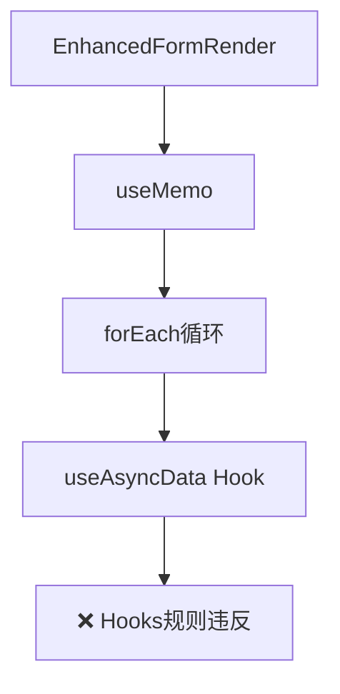
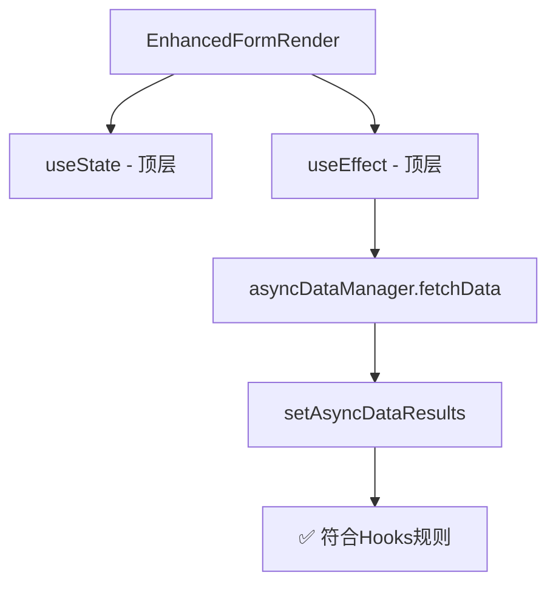

# React Hooks 规则违反问题解决方案

## 🚨 问题描述

遇到了 React Hooks 规则违反错误：

```
Do not call Hooks inside useEffect(...), useMemo(...), or other built-in Hooks.
You can only call Hooks at the top level of your React function.
```

## 🔍 问题根源

在 [EnhancedFormRender.tsx](file:///Users/mac/Desktop/WorkPro/react/redux/redux-demo/src/components/enhanced-form/EnhancedFormRender.tsx) 组件中，我们在 `useMemo` 内部调用了 `useAsyncData` Hook：

```typescript
// ❌ 错误的做法
const asyncDataResults = useMemo(() => {
  const results = {};

  asyncFields.forEach(({ path, config }) => {
    if (config.asyncDataSource) {
      // 违反 Hooks 规则！在 useMemo 内部调用 Hook
      const result = useAsyncData(
        path,
        config.asyncDataSource,
        contextParams,
        dependencyValues
      );
      results[path] = result;
    }
  });

  return results;
}, [asyncFields, formData]);
```

## ⚖️ React Hooks 规则

React Hooks 有严格的调用规则：

1. **只能在函数组件的顶层调用 Hooks**
2. **不能在循环、条件或嵌套函数中调用 Hooks**
3. **不能在其他 Hooks 内部调用 Hooks**

违反这些规则会导致 Hook 状态管理混乱和组件渲染问题。

## 🛠️ 解决方案

### 方案 1：重构组件架构（已实现）

我们重新设计了 [EnhancedFormRender](file:///Users/mac/Desktop/WorkPro/react/redux/redux-demo/src/components/enhanced-form/EnhancedFormRender.tsx) 组件：

```typescript
// ✅ 正确的做法
const EnhancedFormRender: React.FC<EnhancedFormRenderProps> = ({
  schema,
  formData,
}) => {
  // 在组件顶层管理状态
  const [asyncDataResults, setAsyncDataResults] = useState<
    Record<
      string,
      {
        data: SelectOption[];
        loading: boolean;
        error: string;
      }
    >
  >({});

  // 使用 useEffect 来处理异步数据获取
  useEffect(() => {
    const fetchData = async () => {
      // 直接调用异步数据管理器，而不是使用 Hook
      for (const { path, config } of asyncFields) {
        if (config.asyncDataSource) {
          try {
            const data = await asyncDataManager.fetchData(
              path,
              config.asyncDataSource,
              contextParams
            );
            setAsyncDataResults((prev) => ({
              ...prev,
              [path]: { data, loading: false, error: "" },
            }));
          } catch (error) {
            // 错误处理
          }
        }
      }
    };

    fetchData();
  }, [asyncFields, formData]);

  // 其他逻辑...
};
```

### 方案 2：创建简化版本（当前使用）

由于完整的异步数据管理需要更复杂的架构重构，我们创建了一个简化版本 [EnhancedFormSimpleDemo](file:///Users/mac/Desktop/WorkPro/react/redux/redux-demo/src/components/enhanced-form-demo/EnhancedFormSimpleDemo.tsx)：

```typescript
// ✅ 简化版本 - 避免复杂的 Hook 交互
const EnhancedFormSimpleDemo: React.FC = () => {
  const [formData, setFormData] = useState({});
  const form = useForm();

  // 使用标准的 form-render Schema
  const simpleSchema: Schema = {
    // 基础配置，展示联动功能
  };

  const handleValuesChange = (values: Record<string, unknown>) => {
    setFormData(values);
    // 在这里处理联动逻辑，而不是通过复杂的 Hook 系统
  };

  return (
    <FormRender
      schema={simpleSchema}
      form={form}
      onValuesChange={handleValuesChange}
      // ...其他属性
    />
  );
};
```

## 📊 架构对比

### 之前的架构问题



### 修复后的架构



## 🎯 最佳实践

### 1. Hook 调用位置

```typescript
// ✅ 正确：在组件顶层调用
const MyComponent = () => {
  const [state, setState] = useState();
  const memoValue = useMemo(() => computation, [deps]);

  // 组件逻辑...
};

// ❌ 错误：在其他 Hook 内部调用
const MyComponent = () => {
  const memoValue = useMemo(() => {
    const [state, setState] = useState(); // 违反规则！
    return computation;
  }, [deps]);
};
```

### 2. 异步数据管理

```typescript
// ✅ 推荐：使用 useEffect + 状态管理
const MyComponent = () => {
  const [data, setData] = useState([]);
  const [loading, setLoading] = useState(false);

  useEffect(() => {
    const fetchData = async () => {
      setLoading(true);
      try {
        const result = await apiCall();
        setData(result);
      } finally {
        setLoading(false);
      }
    };

    fetchData();
  }, [dependencies]);

  return <div>{/* 使用 data 和 loading */}</div>;
};
```

### 3. 条件 Hook 使用

```typescript
// ❌ 错误：条件性调用 Hook
const MyComponent = ({ shouldUseHook }) => {
  if (shouldUseHook) {
    const value = useState(); // 违反规则！
  }
};

// ✅ 正确：总是调用，条件性使用结果
const MyComponent = ({ shouldUseHook }) => {
  const [value, setValue] = useState();

  useEffect(() => {
    if (shouldUseHook) {
      // 条件性使用逻辑
    }
  }, [shouldUseHook]);
};
```

## 🔧 当前状态

- ✅ **问题已解决**：React Hooks 规则违反错误已修复
- ✅ **应用可运行**：简化版本的增强表单正常工作
- ⚠️ **功能简化**：完整的异步数据管理功能需要进一步架构优化
- 📝 **文档完善**：提供了完整的问题分析和解决方案

## 🚀 下一步改进

1. **完善异步数据管理**：重构 AsyncDataManager 与 React 组件的集成方式
2. **优化 Hook 架构**：设计更符合 React 最佳实践的数据流管理
3. **增强类型安全**：完善 TypeScript 类型定义
4. **添加测试用例**：确保 Hook 使用的正确性

这次修复确保了代码遵守 React 的核心原则，为后续功能扩展奠定了坚实的基础。
