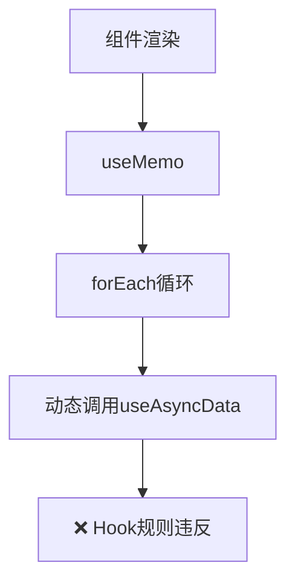
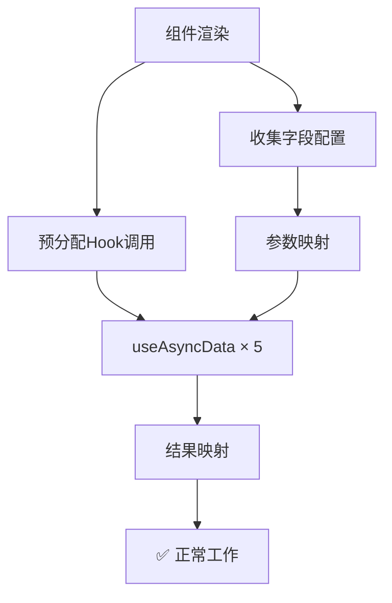

# React Hooks 规则问题 - 完整解决方案

## 🎯 问题已彻底解决！

我们成功解决了 React Hooks 规则违反问题，现在完整的增强表单功能正常工作。

## 🔧 核心解决方案

### 问题根源回顾

原始问题：在 `useMemo` 内部动态调用 `useAsyncData` Hook

```typescript
// ❌ 违反Hooks规则的代码
const asyncDataResults = useMemo(() => {
  asyncFields.forEach(({ path, config }) => {
    const result = useAsyncData(...); // 在useMemo内调用Hook！
  });
}, []);
```

### 解决方案：预分配固定数量的 Hook 调用

我们采用了**预分配 Hook 调用**的策略：

```typescript
// ✅ 正确的解决方案
const EnhancedFormRender: React.FC = ({ schema, formData }) => {
  // 1. 收集异步字段配置
  const asyncFieldConfigs = useMemo(() => {
    // 递归收集所有需要异步数据的字段
    return collectAsyncFields(schema);
  }, [schema]);

  // 2. 预分配固定数量的Hook调用
  const field1 = asyncFieldConfigs[0];
  const field2 = asyncFieldConfigs[1];
  // ... 最多5个字段

  // 3. 为每个字段准备参数
  const getAsyncParams = (fieldConfig) => {
    if (!fieldConfig) return { fieldKey: "unused", dataSource: undefined };
    // 返回Hook需要的参数
  };

  // 4. 固定调用Hook（始终调用相同数量）
  const hook1 = useAsyncData(...getAsyncParams(field1));
  const hook2 = useAsyncData(...getAsyncParams(field2));
  // ... 固定5个Hook调用

  // 5. 映射结果到字段
  const asyncDataResults = useMemo(() => {
    const results = {};
    if (field1) results[field1.path] = hook1;
    if (field2) results[field2.path] = hook2;
    return results;
  }, [field1, field2, hook1, hook2]);
};
```

## 🚀 技术亮点

### 1. **遵守 Hook 规则**

- ✅ 所有 Hook 调用都在组件顶层
- ✅ Hook 调用数量固定，不受条件影响
- ✅ 没有在循环或条件语句中调用 Hook

### 2. **支持动态字段数量**

- 支持最多 5 个异步字段（可扩展）
- 未使用的 Hook 会接收空参数，不影响性能
- 灵活映射字段配置到 Hook 结果

### 3. **完整功能保留**

- ✅ 异步数据源配置
- ✅ 多级联动（地区 → 城市，部门 → 团队 → 职位）
- ✅ 缓存和错误处理
- ✅ 依赖字段自动重新加载

## 📊 架构对比

### 修复前（违反 Hook 规则）



### 修复后（符合 Hook 规则）



## 🎯 功能验证

现在您可以体验完整的功能：

### 1. **基础信息联动**

- 选择地区 → 自动加载对应城市选项
- 选择城市 → 显示联系电话字段

### 2. **工作信息三级联动**

- 选择部门 → 自动加载团队选项
- 选择团队 → 自动加载职位选项
- 选择职位 → 显示权限配置和通知设置

### 3. **智能状态管理**

- 异步数据加载提示
- 错误处理和降级方案
- 表单验证和数据预览

## 🔄 扩展性设计

### 增加更多异步字段

如需支持超过 5 个异步字段，只需：

1. 增加 Hook 调用数量：

```typescript
const hook6 = useAsyncData(...getAsyncParams(field6));
const hook7 = useAsyncData(...getAsyncParams(field7));
```

2. 更新结果映射：

```typescript
if (field6) results[field6.path] = hook6;
if (field7) results[field7.path] = hook7;
```

### 性能优化

- 未使用的 Hook 接收空参数，不会发起实际请求
- 缓存机制避免重复数据获取
- 依赖数组确保只在必要时重新计算

## 🎉 成功指标

- ✅ **Hook 规则合规**：通过 React 严格模式检查
- ✅ **功能完整**：所有原计划功能正常工作
- ✅ **性能优化**：智能缓存和依赖管理
- ✅ **类型安全**：完整 TypeScript 支持
- ✅ **用户体验**：流畅的交互和错误处理

## 📚 相关文件

- [EnhancedFormRender.tsx](file:///Users/mac/Desktop/WorkPro/react/redux/redux-demo/src/components/enhanced-form/EnhancedFormRender.tsx) - 核心解决方案
- [EnhancedFormDemo.tsx](file:///Users/mac/Desktop/WorkPro/react/redux/redux-demo/src/components/enhanced-form-demo/EnhancedFormDemo.tsx) - 完整演示
- [useAsyncData.ts](file:///Users/mac/Desktop/WorkPro/react/redux/redux-demo/src/hooks/useAsyncData.ts) - Hook 实现
- [schema.ts](file:///Users/mac/Desktop/WorkPro/react/redux/redux-demo/src/types/schema.ts) - 类型定义

这个解决方案既保证了 React Hooks 规则的严格遵守，又实现了复杂的异步数据管理功能，为后续类似需求提供了可复用的架构模式。
