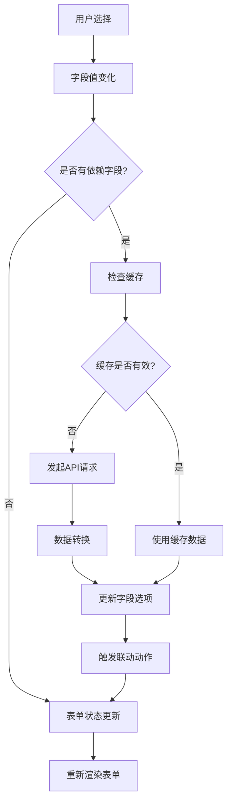

# 增强表单实例使用指南

## 📋 概述

这个增强表单实例展示了如何使用 [EnhancedFormRender](file:///Users/mac/Desktop/WorkPro/react/redux/redux-demo/src/components/enhanced-form/EnhancedFormRender.tsx) 组件来创建复杂的、具有多级联动和异步数据加载功能的表单。

## 🚀 核心特性

### 1. 多级联动功能

- **地区联动**: 地区 → 城市的二级联动
- **工作信息联动**: 部门 → 团队 → 职位的三级联动
- **权限配置**: 基于职位动态加载权限选项

### 2. 智能异步数据管理

- **统一配置**: 通过 `EnhancedSchema` 统一配置所有异步数据源
- **缓存机制**: 自动缓存 API 响应，避免重复请求
- **错误处理**: 内置错误处理和降级方案
- **依赖管理**: 字段依赖变化时自动重新获取数据

### 3. 用户体验优化

- **加载状态**: 数据加载时显示友好的提示信息
- **动态显示**: 基于条件动态显示/隐藏字段
- **表单验证**: 完整的表单验证机制
- **数据预览**: 实时预览表单数据

## 🏗️ 架构设计

### Schema 配置结构

```typescript
const enhancedSchema: EnhancedSchema = {
  type: "object",
  title: "增强表单演示",

  // 全局数据源配置
  globalDataSources: {
    regions: {
      url: '/api/regions',
      method: 'GET',
      cacheTime: 30 * 60 * 1000,
      transform: (data) => [...] // 数据转换函数
    }
  },

  // 字段属性配置
  properties: {
    fieldName: {
      title: "字段标题",
      type: "string",
      widget: "select",
      asyncDataSource: {...}, // 异步数据源配置
      dependencies: [...],    // 依赖字段
      linkage: {...}         // 联动配置
    }
  },

  // 表单级联动配置
  formLinkage: [...]
};
```

### 异步数据源配置

```typescript
{
  url: '/api/endpoint',           // API端点
  method: 'GET',                  // HTTP方法
  params: {                       // 请求参数
    key: "{{formData.field}}"     // 支持表达式
  },
  dependencies: ['field'],        // 依赖字段数组
  cacheTime: 10 * 60 * 1000,     // 缓存时间(毫秒)
  transform: (data) => {          // 数据转换函数
    return data.map(item => ({
      value: item.id,
      label: item.name
    }));
  }
}
```

## 📝 使用示例

### 1. 基本使用

```tsx
import EnhancedFormDemo from "./components/enhanced-form-demo/EnhancedFormDemo";

const App = () => {
  const handleSubmit = async (data: Record<string, unknown>) => {
    console.log("表单数据:", data);
  };

  return <EnhancedFormDemo onSubmit={handleSubmit} />;
};
```

### 2. 自定义初始数据

```tsx
const initialData = {
  basicInfo: {
    name: "张三",
    region: "beijing",
  },
  workInfo: {
    department: "tech",
  },
};

<EnhancedFormDemo onSubmit={handleSubmit} initialData={initialData} />;
```

## 🔧 配置说明

### 字段类型支持

- `string`: 文本输入
- `select`: 下拉选择
- `radio`: 单选按钮
- `checkbox`: 复选框
- `datePicker`: 日期选择器
- `array`: 数组字段（如 checkboxGroup）

### 联动动作类型

- `clear`: 清除字段值
- `reload`: 重新加载异步数据
- `show`: 显示字段
- `hide`: 隐藏字段
- `enable`: 启用字段
- `disable`: 禁用字段

### 表达式支持

在配置中可以使用表达式来实现动态行为：

- `{{formData.field}}`: 引用表单字段值
- `{{!formData.field}}`: 字段值取反
- `{{formData.field === 'value'}}`: 条件判断

## 📊 数据流图



## 🎯 实际应用场景

### 1. 用户信息表单

- 地区城市联动选择
- 职业信息级联配置
- 权限动态分配

### 2. 商品配置表单

- 分类品牌联动
- 规格参数动态加载
- 价格策略配置

### 3. 系统设置表单

- 模块功能联动
- 参数依赖配置
- 权限角色分配

## 📈 性能优化

### 1. 缓存策略

- 根据数据更新频率设置合理的缓存时间
- 自动清理过期缓存
- 支持手动清除缓存

### 2. 请求优化

- 防止重复请求
- 请求去重处理
- 错误重试机制

### 3. 渲染优化

- 按需渲染字段
- 虚拟化长列表
- 避免不必要的重新渲染

## 🚀 最佳实践

1. **合理设置缓存时间**: 根据数据变化频率设置
2. **优化数据转换**: 在 transform 函数中进行必要的数据处理
3. **错误处理**: 提供降级方案和用户友好的错误提示
4. **依赖关系**: 明确定义字段间的依赖关系
5. **性能监控**: 监控 API 请求性能和缓存命中率

## 📚 相关文档

- [类型定义](file:///Users/mac/Desktop/WorkPro/react/redux/redux-demo/src/types/schema.ts)
- [异步数据管理器](file:///Users/mac/Desktop/WorkPro/react/redux/redux-demo/src/utils/AsyncDataManager.ts)
- [React Hooks](file:///Users/mac/Desktop/WorkPro/react/redux/redux-demo/src/hooks/useAsyncData.ts)
- [增强表单组件](file:///Users/mac/Desktop/WorkPro/react/redux/redux-demo/src/components/enhanced-form/EnhancedFormRender.tsx)

这个增强表单实例为复杂表单应用提供了完整的解决方案，既保证了开发效率，又确保了用户体验和系统性能。
